# 배포하기

## AWS EC2 / Nginx를 사용하여 배포하기

`AWS`에서 제공하는 클라우드 인스턴스를 `EC2`라고 한다. 여기서 인스턴스란 가상 서버 컴퓨터를 말한다.

이러한 인스턴스를 생성하고 웹서버인 `Nginx`와 함께 작업한 결과물을 배포해보려고 한다.

### 1. EC2 인스턴스 생성

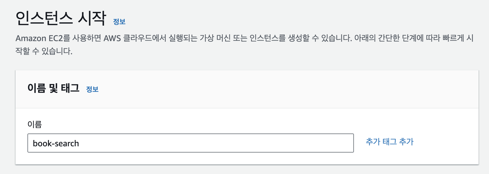

EC2 이름이나 태그를 지정한다.

### 2. AMI(인스터를 생성하는데 필요한 소프트웨어 구성 템플릿)

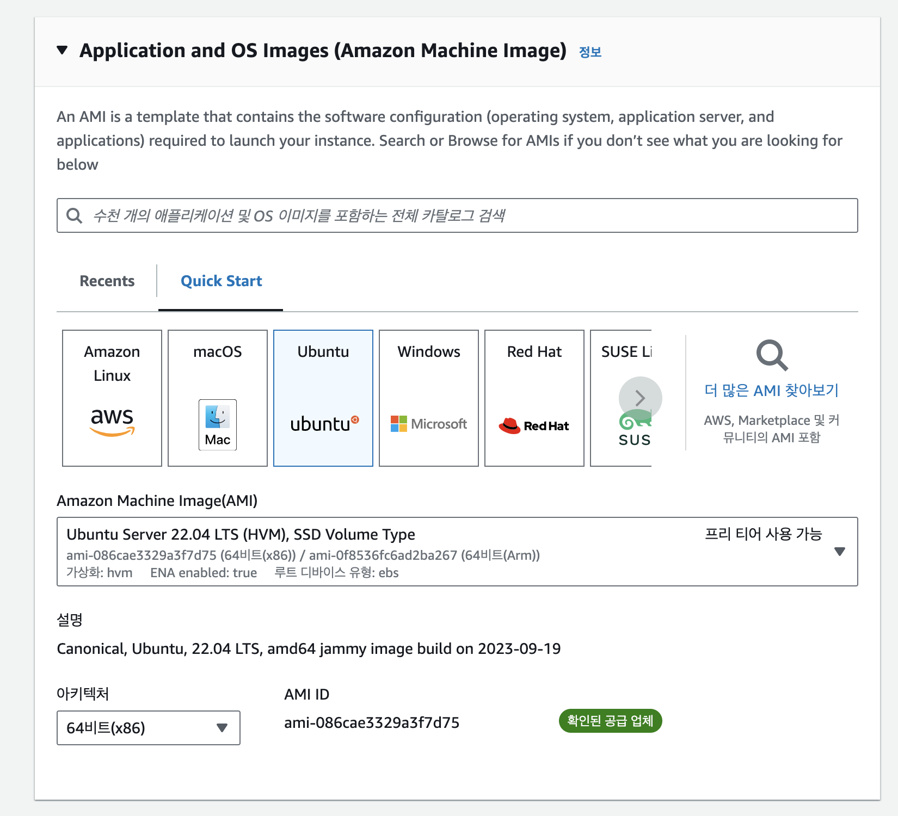

EC2에서 사용할 OS를 선택한다.

여기서 Ubuntu를 사용했다.

### 3. 인스턴스 유형

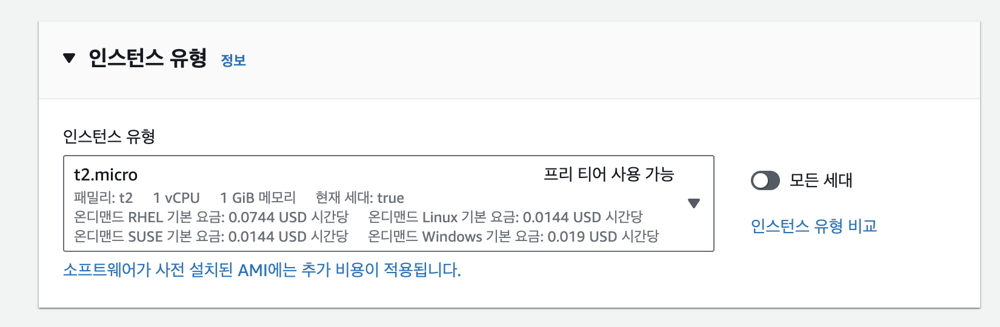

일정기간 무료로 사용 가능한 t2.micro를 선택한다.

### 4. 키 페어 생성

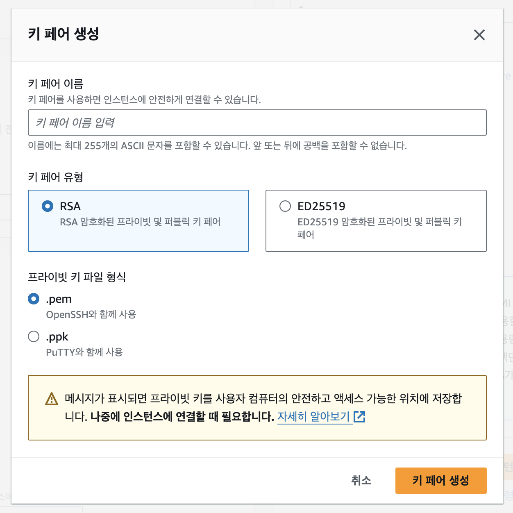


키 페어를 생성하게 되면 .pem 형식으로 다운로드된다.

(pem 키는 AWS 컴퓨터 환경에 프라이빗하게 접근할 수 있는 키를 말한다.)

### 5. 네트워크 설정

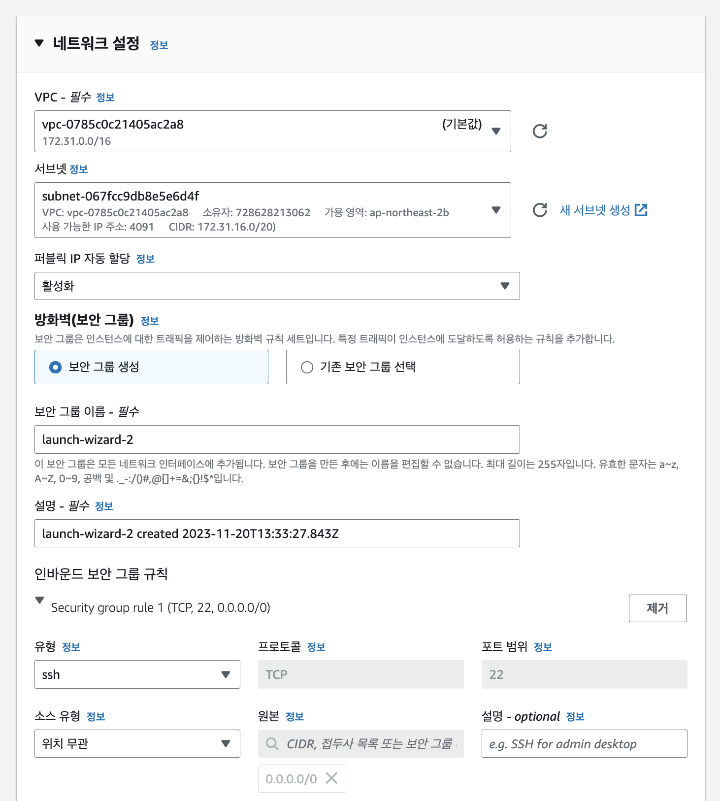

편집으로 들어가서 설정한다.

- **서브넷**
  IP가 사용 가능한 곳으로 설정한다.
- **퍼블릭**
  IP 자동 할당은 활성화 상태로 한다.
- **보안 그룹 규칙**
  이후 다른 사용자도 배포된 프로젝트에 접근 가능하도록 하는 설정이다.

### 6. 스토리지 구성

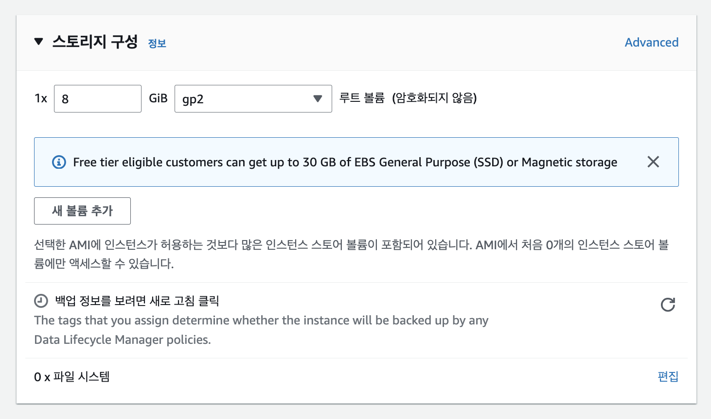

### 7. 인스턴스 시작

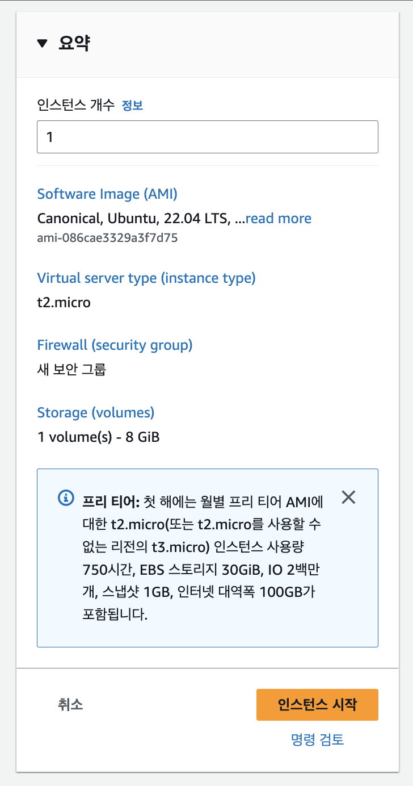

위 설정 후 인스턴스 시작을 누른다.

이후 생성된 인스턴스를 확인할 수 있다.

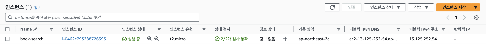

### 8. 인스턴스 접속

mac 기준 터미널에서 인스턴스로 접근해 보려고 한다.

여기서 주의할 점은 이전에 다운받은 `pem`파일이 필수로 필요하다.

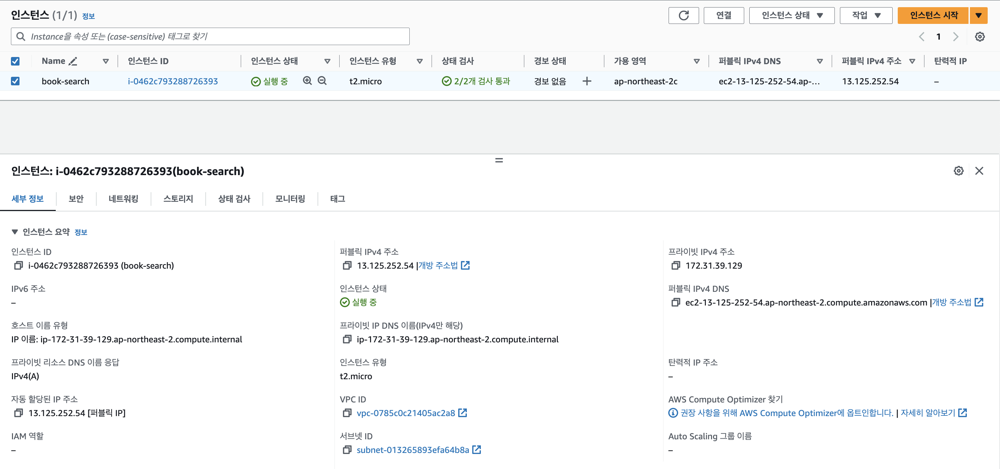

터미널을 열어 키 페어 생성을 통해 얻은 `pem`파일이 있는 폴더로 이동한 후

아래 명령어로 키 페어에 읽기 권한을 부여한다.

```jsx
chmod 400 키페어이름.pem
```

그 다음 아래 명령어로 `ssh` 접속을 한다. `퍼블릭 IPv4 주소`는 인스턴스 세부정보에서 확인할 수 있다.

```jsx
ssh -i 키페어이름.pem ubuntu@퍼블릭 IPv4 주소
```

이후 아래처럼 나오면 인스턴스 접속에 성공한 것이다.

```jsx
ubuntu@ip-주소:~$
```

### 9. 웹페이지 빌드

생성한 인스턴스는 빈 상태이기 때문에 올리려고 하는 git repo를 클론한다.

```jsx
git clone repo주소
```

추가로 ubuntu 서버도 빈 상태이기 때문에 npm과 node를 설치해준다.

### 10. 웹서버 - Nginx

서버 컴퓨터에 웹서버를 설치 하여 구동시켜야 배포가 가능하다.

Nginx를 사용하여 환경을 만들고자 한다.

설치

```jsx
sudo apt-get install nginx
```

이후 퍼블릭 IPv4 주소로 접속 시 아래 화면이 나온다면 웹서버가 정상적으로 설치된 것이다.

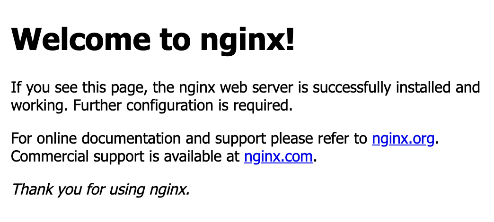

그 다음 html 문서가 존재하는 루트 폴더의 위치를 직접 설정하기 위해

인스턴스 접속 후 `/etc/nginx/sites-enabled` 해당 경로 이동을 하려 했지만 경로를 찾을 수 없었다.

그래서 상위 경로로 이동하여 `/etc/nginx/sites-enabled/default` 라는 파일을 찾았다.

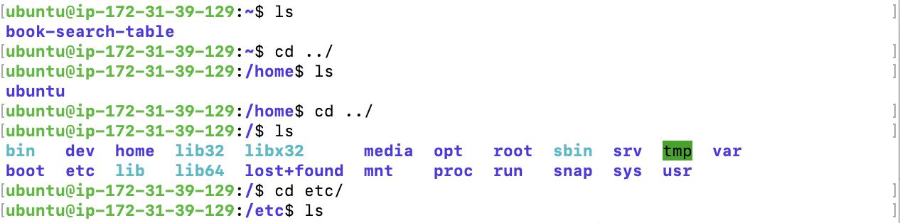

해당 파일에서 i로 편집모드를 실행하여

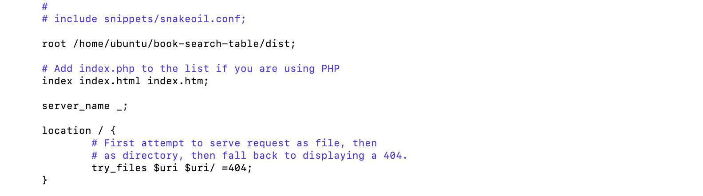

> root /var/www/html;  ➡ root /home/ubuntu(host 이름)/**내 빌드 파일이 담긴 폴더 이름** index index.html index.htm index.nginx-debian.html ➡ 제거

위처럼 입력 후 편집 모드 종료한다.

esc (편집 모드 종료) / :wq (저장 및 종료) / :wq! (강제 저장 및 종료)

이후 마지막으로 nginx 서버를 재구동한다.

- sudo service nginx stop (서버 중지)
- sudo service nginx start (서버 시작)
- sudo service nginx restart (서버 재구동)
