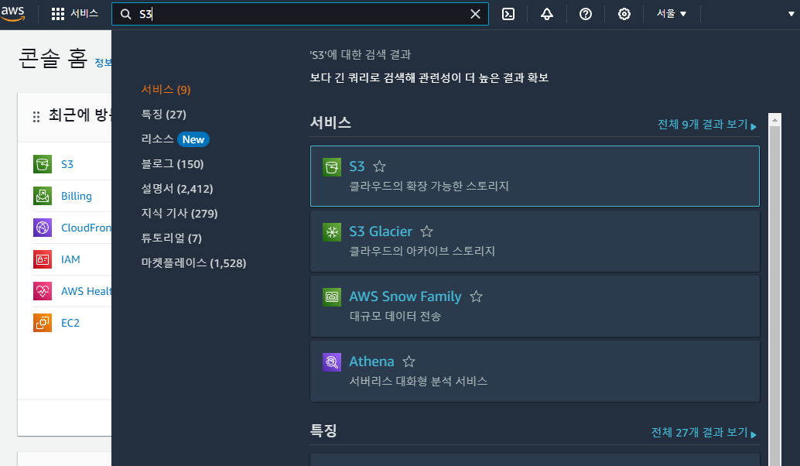

# S3 + Cloud front + github actions 배포 과정

## ✋ 개요

기존에 진행했던 `EC2 + Ngnix` 배포는 실무에서는 잘 쓰이지 않는다는 얘기를 전달 들었다. (실제로는 `ECS`를 더 애용)<br>
_(물론 EC2에 SSH로 접근하여 Ngnix를 이용해서 웹 서버를 구현해본 경험은 값진 경험이였다.)_<br>

프론트서버 특히 리액트 같이 정적인 파일을 제공해주는 웹서버는 `EC2` 보다는 `S3`를 이용해서 주로 배포한다는 사실을 알았고 이번에 직접 `S3`를 생성후 `Clound Front`를 이용해서 배포 해보고 `github actions`를 이용해서 간단한 `CI/CD`를 구축한 과정을 작성해보도록 하겠다.

## 📋 과정

### 1️⃣ S3(Amazon Simple Storage Service) 버킷 생성

우선 `S3`를 생성해야 한다. 콘솔에서 `S3`를 검색한 뒤 `S3` 페이지로 이동해주도록 하자<br><br>


`S3` 페이지로 이동후 버킷 만들기를 클릭하여 버킷을 만들어 주도록 하자<br><br>


버킷을 만들 때 주의할 점은 해당 버킷은 전역적으로 고유해야 한다<br>
즉 중복되는 버킷 이름은 작성 할 수가 없다. 해당 배포과정을 진행 할 때 개인 계정에서만 중복되지 않으면 괜찮다고 생각했다<br> 
하지만 같이 스터디를 진행하던 인원과 버킷 이름이 동일하자 생성이 안되는 문제를 겪었다. 그러므로 버킷 이름은 꼭 고유하게 작성해주도록 하자<br>
aws리전은 가장 가까운 `ap-northeast-2`로 설정해주자<br><br>


그 다음은 객체 소유권을 설정해줘야한다. 스터디를 진행 할 때 첫 고비였다<br>
객체 소유권이란 쉽게 말하면 버킷에 업로드된 객체 즉 업로드 된 파일을 소유한 사람과 결과적으로 해당 객체를 관리하고 액세스 할 권한이 있는 사람을 결정하는 부분이다. `ACL`을 활성화 하면 객체 소유권을 버킷 소유자 선호와 객체 라이터로 구분 할 수 있다.<br>

> -  버킷 소유자 선호: 해당 설정은 `S3` 버킷에 업로드되는 객체의 소유권을 결정한다. 해당 설정이 활성화되면 `S3` 버킷을 소유한 `AWS` 계정도 해당 버킷에 업로드 되는 모든 객체의 소유자가 된다. 즉 해당 버킷에 업로드 된 객체를 삭제하고 액세서를 제어하는 기능을 포함해 버킷 내에 저장된 객체를 완전히 제어할 수 있다. 그러나 버킷 소유자 기본 설정이 비활성화 되면 객체 소유자는 객체를 업로드한 `AWS` 계정에 의해 결정되며 버킷 소유자와 동일하지 않을 수 있다.
> - 객체 라이터: 객체 작성자는 객체를 `S3` 버킷에 업로드하는 `AWS` 계정 또는 `IAM` 사용자이다 객체 라이터는 업로드 작업을 수행 할 때 사용 되는 자격 증명에 따라 결정되며 `AWS`계정, `IAM` 사용자 또는 익명 사용자 일 수 있다. 객체 작성자는 수정 또는 삭제 기능을 포함해 객체에 대한 모든 권항을 가진다.

<br>

> 이 두 설정의 차이는 누가 버킷에 업로드 된 객체의 소유권을 가지느냐이다 전자의 경우 모든 객체의 버킷 소유권을 부여하는 반면 후자는 업로드한 계정이 해당 객체의 소유권을 가질 수 있다. `ACL` 설정을 하지 않으면 객체에 대한 액세스는 버킷 정책에 의해서 결정된다. `ACL` 설정이 활성화되면 객체 소유자는 버킷 정책을 재정의하여 특정 사용자 또는 사용자 그룹에 대한 권한을 설정할 수 있다.<br>

해당 내용을 공부하기 전 그러니까 현재 설정된 값은 `ACL`을 활성화 해두었는데 특별한 사유가 없으니 `ACL`을 비활성화로 변경해야겠다.
<br><br>


해당 `S3`는 웹서버처럼 이용하기 위해 외부의 접근을 허용해야한다. 그러므로 모든 퍼블릭 엑세스를 허용하고 아래 생성되는 경고창을 체크해주도록하자
<br><br>


이후 버킷 버전관리, 태그는 이번 과정에선 필요가 없으니 패스해주고 암호화는 Amazon S3 관리형 키를 그대로 선택해주고 고급설정은 사용할 일이 없으니 비활성화하고 버킷을 만들어 주도록 하자
<br><br>


---

### 2️⃣ S3(Amazon Simple Storage Service) 버킷 설정 변경 및 정책 설정

버킷이 잘 생성됐다. 이제 해당 버킷을 선택해서 액세서를 퍼블릭으로 설정해주도록 하자 (현재 이미지의 버킷은 이미 퍼블릭으로 수정해둔 상태이다.)
<br><br>


버킷을 클릭 후 속성탭으로 이동해서 가장아래의 정적 웹 사이트 호스팅 섹션으로 이동하여 편집을 눌러주도록 하자
<br><br>


이후 정적 웹 사이트 호스팅 활성화를 체크해주고 호스팅 유형도 정적 웹 사이트 호스팅으로 체크해주도록 하자 또한 인덱스 문서와 오류 문서를 `index.html` 으로 작성해주도록 하자 (이번 스터디에서는 React를 배포할 예정이므로 두 개 전부 React를 빌드할 때 나오는 html 파일인 `index.html`로 작성해 주도록 하자)
<br><br>


그 다음 권한탭으로 이동해서 버킷 정책을 설정해주도록 하자 정책은 JSON 타입처럼 작성해주는데 내가 직접 작성하는게 아니라 정책생성기에서 정책을 고른 뒤 생성하면 JSON 파일 처럼 작성된다. 이번 배포에서 정책 생성은 아래 처럼 선택해주면 된다.<br><br>


- Select Type of Policy: S3 Bucket Policy
- Effect: Allow 
- Principal: * 
- Actions: GetObject 선택 (버킷 접근 권한)
- Amazon Resource Name(ARN): '버킷 정책 편집 페이지'의 버킷 ARN을 복사한 후, 뒷부분에 /*을 붙여서 입력.


---

### 2️⃣ S3(Amazon Simple Storage Service)에 파일 업로드 하기

`S3` 세팅은 일단락 했다. 이제 실제 빌드된 파일을 업로드해야 한다.<br>
물론 `AWS GUI`를 이용해서 업로드 하는 방법도 있지만 조금 더 개발자스럽게 `AWS CLI`를 이용하기로 했다.<br>
`AWS CLI` 설치 방법은 AWS에서 잘 설명해주고 있다 [링크](https://docs.aws.amazon.com/ko_kr/cli/latest/userguide/getting-started-install.html)<br>
본인은 mac을 이용해서 스터디를 진행했기 때문에 
```shell
$ curl "https://awscli.amazonaws.com/AWSCLIV2.pkg" -o "AWSCLIV2.pkg"
$ sudo installer -pkg AWSCLIV2.pkg -target /
```
해당 명령어를 통해 설치 후
```shell
$ which aws
/usr/local/bin/aws 
$ aws --version
aws-cli/2.10.0 Python/3.11.2 Darwin/18.7.0 botocore/2.4.5
```
해당 명령어를 통해 잘 설치 됐는지 확인했다. (설치가 어려우면 상단 링크를 참조하자)<br>

---

### 3️⃣ IAM 계정 설정

`AWS CLI`를 이용해서 업로드 하기 위해서는 설치 후 내 컴퓨터에 `AWS configure` 설정을 해줘야 한다.<br>
해당 설정을 위해서는 `IAM` 계정을 만들어야 하므로 콘솔에 `IAM`을 검색하고 `IAM` 페이지로 이동하도록 하자<br><br>


이후 좌측의 사용자 섹션으로 이동하여 사용자 추가를 클릭 해주도록 한다.<br><br>


사용자 이름을 입력해주고 직접 정책 연결을 선택해준뒤 `AmazonS3FullAccess`와  `CloudFrontFullAccess`를 체크 해주고 검토 및 생성 섹션에서 사용자를 생성해준다<br><br>


이후 성공적으로 생성되면 해당 `IAM` 계정을 외부에서 사용할 수 있게 하려면 보안 자격 증명에서 액세스 키를 만들어야 한다.<br>
생성된 사용자를 클릭하여 보안 자격 증명 탭으로 이동한다. <br><br>


엑세스 키 모범 사례 및 대안은 스터디하면서 두 번째로 찾아온 위기 였다<br>
검색해보면 무엇을 선택하나 큰 문제는 없지만 각 부분이 어떤 의미를 가지고 있는지는 학습이 필요해 보인다.<br>
우선 이번 스터디에서는 `AWS` 외부에서 실행되는 애플리케이션을 선택했다.<br>
(허나 찾아보면 `github actions`를 위해서 서드 파티 서비스를 사용하는 것 처럼 보인다.)<br><br>


이후 태그를 설정하고 엑세스 키는 `.csv 파일 다운로드` 혹은 해당 값들을 기억해두면 된다. 이후 다운이 완료되면 `IAM` 계정 설정이 완료됐다.<br>

---

### 4️⃣ IAM 계정 AWS 연동

이제 `IAM` 계정을 `AWS CLI`를 이용해 연동해보도록 하자.<br>
터미널에서 `aws configure --profile [IAM 사용자 이름]` 명령어를 입력해준다<br>
그 뒤 아래 처럼 순서대로 입력해주고
```shell
AWS Access Key ID: csv 파일에서 Access key Id를 찾아 입력
AWS Secret Access Key: csv 파일에서 Secret access key를 찾아 입력
Default region name: ap-northeast-2 
Default output format: json 
```
배포하고자 하는 폴더로 이동하여 해당 디렉토리에서 아래와 같이 입력해준다<br>
`aws s3 sync ./build s3://[S3 버킷 이름] --profile=[IAM 사용자 이름]`<br>
해당 작업을 완료하면 `S3`에 `build` 폴더 안에있는 파일이 업로드된걸 확인할 수 있다.

---

### 5️⃣ Cloud Front 연동

해당 작업만 완료해도 브라우저에서 `S3`로 접근해 빌드한 파일을 확인할 수 있다.<br>
하지만 대부분 실무에서는 `Cloud Front`를 이용해서 배포를 하는데 해당 이유는 아래와 같다<br>

> Amazon CloudFront는 .html, .css, .js 및 이미지 파일과 같은 정적 및 동적 웹 콘텐츠를 사용자에게 더 빨리 배포하도록 지원하는 웹 서비스입니다. CloudFront는 엣지 로케이션이라고 하는 데이터 센터의 전 세계 네트워크를 통해 콘텐츠를 제공합니다. CloudFront를 통해 서비스하는 콘텐츠를 사용자가 요청하면 지연 시간이 가장 낮은 엣지 로케이션으로 요청이 라우팅되므로 가능한 최고의 성능으로 콘텐츠가 제공됩니다.

이러한 이유로 `Cloud Front`를 연동하도록 하겠다. 가장 먼저 `AWS` 콘솔창에 `Cloud Front`를 검색하여 해당 페이지로 이동해서 `배포 생성` 을 클릭해주도록 하자.<br><br>


이후 원본 도메인을 방금전 작업한 S3로 선택해주고 웹 사이트 엔드포인트 사용을 체크해주도록 하자.<br>
나머지 설정은 우선 이번 스터디는 배포에 목적이 있기 때문에 기본값으로 설정했지만 `웹 애플리케이션 방화벽(WAF)` 설정에서 한 번 더 위기가 찾아왔다. 해당 부분이 정확히 어떻게 사용되는지 학습할 필요가 있어 보인다. 우선은 이번 스터디에서는 보안 보호를 비활성화 했다.<br><br>


이후 배포생성을 누르고 해당 `Cloud Front`에 접속하여 배포 도메인 이름을 클릭하면 배포한 사이트가 나타나는 걸 볼 수 있다.

---

### 6️⃣ github actions를 이용한 CI/CD 구축

이제 해당 프로젝트의 `main` 브랜치에 `push`가 되면 자동으로 빌드 및 배포를 가능하게하는 `CI/CD`를 `github actions`를 이용해서 구축해보자<br>

우선 먼저 `actions`를 구축할 레포의 `settings` 항목으로 이동한다.<br>
이후 좌측의 `Secrets and variables` 항목의 `Actions` 섹션으로 이동해서 `New repository secret`를 클릭 해준다..
<br><br>


그 다음 CSV 파일을 확인해 `Access key ID`와 `Secret access key`값을 확인한다<br>
그리고 `name`을 `AWS_ACCESS_KEY_ID`로 하여 `Access key ID`값을 저장하고<br>
한 번 더 `name`을 `AWS_SECRET_ACCESS_KEY`으로 하고 `Secret access key` 값을 저장한다

이제 Actions를 설정 해주자 해당 레포에서 Actions 섹션으로 이동한다. 그리고 `set up workflow yourself` 를 클릭하고 아래와 같은 코드를 작성해준다. (그러면 해당 레포 루트에 `.github/workflows/filename.yml` 이란 파일이 생성된다)

```yml
name: Node.js Package # 임의로 설정 가능

on:
  push:
    branches: ["main"] # push시 배포할 branch명

jobs:
  build-and-deploy:
    runs-on: ubuntu-latest # 해당 작업은 Ubuntu 최신 버전의 실행환경에서 실행된다느 ㄴ의미
    steps: # 순차적으로 실행될 단계들의 목록
      # git 소스 체크아웃
      - name: git checkout # git 소스 코드를 체크아웃하고
        uses: actions/checkout@v3 # github actions의 checkout 액션을 사용한다.

      # node 버전 설정
      - name: setup node
        uses: actions/setup-node@v2.5.2 # github actions의 setup-node 액션을 사용하여 특정 버전인 2.5.2를 지정
        with:
          node-version: 16.x # node 버전은 16.x 버전으로 설정
      # npm install 진행(모듈 설치)
      - name: npm install
        run: npm install # 이후 npm install을 통해 종속성을 설치하고

      # 리엑트 프로젝트 빌드
      - name: npm build
        run: npm run build # 해당 react 프로젝트를 빌드하기 위해 npm run build 명령어 실행

      # s3에 배포
      - name: deploy s3
        env:
          AWS_ACCESS_KEY_ID: ${{ secrets.AWS_ACCESS_KEY_ID }}
          AWS_SECRET_ACCESS_KEY: ${{ secrets.AWS_SECRET_ACCESS_KEY }}
        run:
          # 환경 변수로 AWS의 액세스 키와 시크릿 키가 사용되며 aws s3 sync 명령어를 통해 지정된 버킷으로 동기화 한다.
          # sync : 변경된 파일만 / --delete : 원본경로에서 삭제시 타깃에서도 삭제
          aws s3 sync --delete --region ap-northeast-2 ./dist s3://jaehunsgrbucket
```

> - `name` : 해당 단계의 이름을 사용자가 지정합니다. 이는 단계를 식별하기 위한 용도로 사용됩니다.
> - `uses` : GitHub Actions에서 제공하는 기존의 액션을 사용할 때 지정합니다. 이를 통해 미리 만들어진 액션을 가져와 사용할 수 있습니다.

예를 들어, `git checkout`은 단계의 이름이고, 이 단계에서는 `uses`를 통해 `GitHub Actions`에서 제공하는 `checkout` 액션을 사용하고 있습니다. 사용자가 직접 만든 스크립트나 명령어를 실행하려면 대신에 `run` 키워드를 사용하여 스크립트를 실행할 수 있습니다.

> - `aws s3 sync` : AWS CLI에서 S3와 관련된 명령을 실행하는 부분입니다.
> - `--delete` : 이 옵션은 대상 S3 버킷에서 로컬 파일 시스템에 없는 파일들을 삭제하는 옵션입니다. 로컬 파일 시스템에서 삭제된 파일들을 대상 S3 버킷에서도 삭제합니다.
> - `--region ap-northeast-2` : 이 명령은 AWS 지역을 나타내며, 여기서는 아시아 태평양 (서울) 리전을 가리킵니다.
> - `./dist` : 로컬 파일 시스템에서 동기화할 파일들의 소스 경로입니다. 여기서는 현재 디렉토리 기준으로 dist 폴더를 가리킵니다.
s3://버킷명: 동기화될 대상 S3 버킷을 가리킵니다. 버킷명 자리에 실제 S3 버킷의 이름이 들어갑니다.

해당 작업을 완료했으면 `main` 브랜치에 `push` 되면 자동으로 빌드 후 배포가 완료된다.

그러나 S3에 수정된 파일이 올라갔으나 실제 브라우저로 URL에 접속하면 변경된 점을 확인할 수 없다. 이는 `Colud Front`의 캐싱 처리 때문이다.

이런 문제를 해결해주기 위해서 배포가 완료되면 해당 `Cloud Front`로 접속해 무효화 섹션으로 이동하여 무효화를 생성하고 객체 경로에 `/*` 값을 입력해주면 새로 빌드한 파일을 브라우저에서 확인할 수 있다.

물론 이러한 작업은 매우 귀찮기 때문에 유연한 캐시정책을 수립해서 `Clound Front`의 동작 섹션에서 `캐시 키 및 원본 요청` 값을 수정해줘야하는데 해당 부분 역시 공부가 더 필요하다.

---

## 🙋‍♂️ 소감

걱정했던 것 보단 스무스하게 진행했다. 물론 디테일한 설정에 들어가면 더 봐야할 부분이 많겠지만 단순히 배포만을 목적으로 한다면 해당 방법을 통해서 빠르게 배포할 수 있을 것 같다. 물론 중간중간 권한설정, 캐싱 정책, AWS cli 같은 부분에서 시간이 걸리긴 했지만 크게 어렵다고 생각하지는 않았다 (물론 해당 부분은 더 공부가 필요하다) 이로서 `EC2 + Ngnix` 배포와 `S3 + Clound front` 배포를 완성해봤다. 다음에는 ECS를 통해 도커를 이용해서 배포를 진행해 봐야겠다.