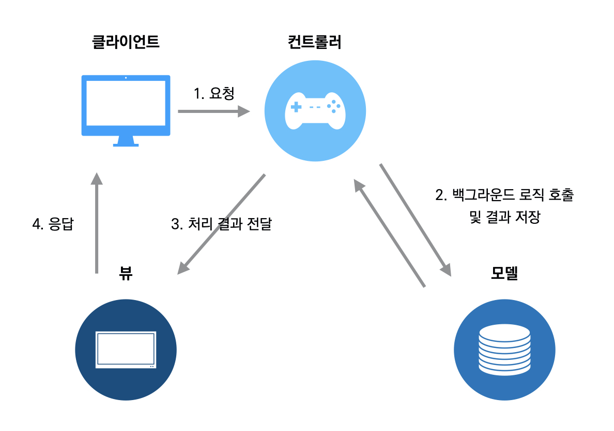
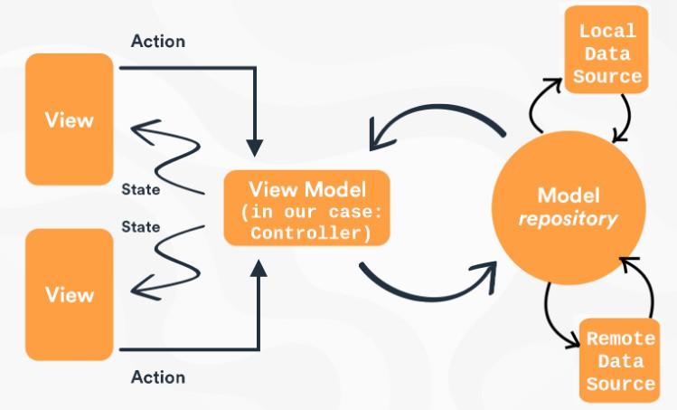

# 디자인패턴

<aside>
💡 해당 강의는 유투버 개발하는남자의 [강의](https://www.youtube.com/watch?v=UJQRiypV6UA)를 듣고 내용을 정리한 글이다.

</aside>

# **디자인 패턴 개발하는데 꼭 필요한가?**

## 1. 디자인 패턴이란 무엇인가

### 1. 정의

<aside>
💡 Dessign

- 설계하다, 디자인하다

Pattern

- 되풀이 되는 사건이나 물체의 형태
</aside>

- 반복되는 소스코드, 구조등을 설계하여 정의내린 것을 **디자인패턴**이라 할 수 있다
- **디자인패턴**은 누군가가 정의내린 개발방식
- 패턴이 생성된 이유는 반복되는 개발에서 조금더 손쉽게 확장성 있고 유지보수가 쉽게 되기위해

### 2. 디자인 패턴을 학습하기 어려운 이유

- 개개인 별 개발 실력이 다르기 때문에
- 개발 스타일 / 철학이 존재하기 때문에
- 디자인 패턴 역시 수십년에 검증된 개발 패턴이라 할지라도 해당 개발자의 철학이나 스타일에 익숙하지 않기 때문

### 3. 왜 디자인 패턴을 배워야할까?

- 검증완료
- 소스코드 해석 / 유지보수
- 시간절약

### 4. 정리

- 디자인 패턴의 장점
  - 개발속도가 빨라진다.
  - 새로 접하는 소스코드라 할지라도 내가 알고 있는 패턴이면 구조를 쉽게 파악 가능
  - 이미 검증된 방식이라 믿고 사용가능
  - 개발자들간의 커뮤니케이션 원할
- 디자인 패턴의 단점
  - 학습 시간이 필요하다.
  - 부족한 숙련도는 오히려 좋지 못한 코드를 작성하게 한다.

## 2. 플러터에서 mvc 패턴 어떻게 사용될까?

### 1. MVC 정의

- 비즈니스 로직은 별도로 분리
- 화면과 이벤트 별도 관리 CASE
- MVC 패턴 예시
  
  - 해당 이미지는 기본적인 MVC 패턴의 흐름이다.
  - 진행순서
    1. 클라이언트가 컨트롤러에 (데이터 여기서 데이터란 JSON 혹은 HTML) 요청을 함
    2. 컨트롤러가 모델에서 요청 하는 데이터를 가져옴
       1. 여기서 컨트롤러에는 원래 복잡한 함수들이 존재하지만 이를 따로 서비스로 빼버림
       2. Model 역시 마찬가지로 Model과 Repository로 분할한다.
          1. **Model**: 데이터 구조와 데이터베이스 테이블을 매핑하는 역할을 한다. 주로 데이터를 표현하는데 사용되며, 도메인 객체로서 애플리케이션의 비즈니스 로직과 관련된 속성과 메서드를 포함할 수 있다.
          2. **Reposiotry**: 데이터베이스와 상호작용을 담당하는 계층 CRUD 작업과 같은 데이터 접근 로직을 처리한다. Repository는 엔티티 객체를 데이터베이스에 저장하거나 엔티티 객체를 가져오는 역할을 한다.
       3. 이렇게 사용함으로서 비즈니스 로직에서 리포지토리를 재사용할 수 있다.
    3. 가져온 데이터를 뷰에 전달함
    4. 뷰에서 요청한 데이터를 클라이언트에 전달해준다.

### 2. 플러터에서 사용

1. **노말패턴**

   ```tsx
   import 'package:flutter/material.dart';

   class NormalView extends StatefulWidget {
     NormalView({Key? key}) : super(key: key);

     @override
     State<NormalView> createState() => _NormalViewState();
   }

   class _NormalViewState extends State<NormalView> {
   	// 모델 담당
     int count = 0;
     void update() => setState(() {});

   	// 컨트롤러 담당
     void incrementCounter() {
       count++;
       update();
     }

   	// 컨트롤러 담당
     void decrementCounter() {
       count--;
       update();
     }


   	// 뷰 담당
     @override
     Widget build(BuildContext context) {
       return Scaffold(
         appBar: AppBar(title: const Text('NO 패턴')),
         body: Center(
           child: Column(
             mainAxisAlignment: MainAxisAlignment.center,
             children: [
               Text(count.toString(), style: TextStyle(fontSize: 150)),
               Row(
                 mainAxisAlignment: MainAxisAlignment.center,
                 children: [
                   Padding(
                     padding: const EdgeInsets.all(8.0),
                     child: ElevatedButton(
                         onPressed: incrementCounter, child: const Text('+')),
                   ),
                   Padding(
                     padding: const EdgeInsets.all(8.0),
                     child: ElevatedButton(
                         onPressed: decrementCounter, child: const Text('-')),
                   ),
                 ],
               )
             ],
           ),
         ),
       );
     }
   }
   ```

   - 해당 기능처럼 복잡하지 않을 경우에는 패턴을 사용하기보단 간단하게 제작하는 것 이 좋다.

2. **MVC 패턴**

   1. 예시

      1. 모델

         ```tsx
         class Model {
           int _count = 0;

           int get counter => _count;
           int incrementCounter() => ++_count;
           int decrementCounter() => --_count;
         }
         ```

      2. 뷰

         ```tsx
         import 'package:dev_pattern_sample/src/mvc/controller/mvc_controller.dart';
         import 'package:flutter/material.dart';
         import 'package:mvc_pattern/mvc_pattern.dart';

         class MVCView extends StatefulWidget {
           MVCView({Key? key}) : super(key: key);

           @override
           State createState() => _MVCViewState();
         }

         class _MVCViewState extends StateMVC<MVCView> {
         	// 컨트롤러 생성 con이란 변수에 할당
           _MVCViewState() : super(MVCController()) {
             con = controller as MVCController;
           }

         	// 변수에 할당
           late MVCController con;

           @override
           Widget build(BuildContext context) {
             return Scaffold(
               appBar: AppBar(title: const Text('MVC 패턴')),
               body: Center(
                 child: Column(
                   mainAxisAlignment: MainAxisAlignment.center,
                   children: [
         	          // con 컨트롤러를 받아서 화면에 찍어주는중
                     Text(con.model.counter.toString(), style: TextStyle(fontSize: 150)),
                     Row(
                       mainAxisAlignment: MainAxisAlignment.center,
                       children: [
                         Padding(
                           padding: const EdgeInsets.all(8.0),
                           child: ElevatedButton(
                               onPressed: () {
                                 con.incrementCounter();
                               },
                               child: const Text('+')),
                         ),
                         Padding(
                           padding: const EdgeInsets.all(8.0),
                           child: ElevatedButton(
                               onPressed: () {
                                 con.decreamentCounter();
                               },
                               child: const Text('-')),
                         ),
                       ],
                     )
                   ],
                 ),
               ),
             );
           }
         }
         ```

      3. 컨트롤러

         ```tsx
         import 'package:dev_pattern_sample/src/model/model.dart';
         import 'package:mvc_pattern/mvc_pattern.dart';

         // MVC 라이브러리는 ControllerMVC 를 상속받음
         class MVCController extends ControllerMVC {
           factory MVCController([StateMVC? state]) => _this ??= MVCController._(state);

           MVCController._(StateMVC? state)
               : model = Model(),
                 super(state);

           static MVCController? _this;
           final Model model;

           void update() => setState(() {});

           void incrementCounter() {
             model.incrementCounter();
             update();
           }

           void decreamentCounter() {
             model.decrementCounter();
             update();
           }
         }

         // 스테이트 관리를 컨트롤러에서 해준다.
         ```

      - 모델의 값을 컨트롤러가 하고 있고 화면 갱신(뷰 업데이트)도 컨트롤러가 하고있다.

   2. 단점
      1. 컨트롤러가 모든 것을 담당하고 있어서 로직이 비대해진다.

<aside>
❓ 아니 그런데 지금 내가 이해 안가는 부분은 MVC에서는 모델을 직접 수정하고 있다고 하는데 컨트롤러에서 Model() 인스턴스를 생성하면 모델을 직접 수정하는게 아니라 컨트롤러 클래스에 생성된 멤버변수 값을 수정하고 있는게 아닌가? 해당 부분 해결이 필요하다

</aside>

## 3. 플러터에서 MVVM 패턴 어떻게 사용될까? (GextX, Provider)

### 1. 왜 MVVM 패턴이 나오게 됐을까?

- 세상에 완벽한 디자인 패턴은 없다
- MVC 패턴은 View와 Model 간 의존성이 너무 높다는 단점
- 모델의 변화가 충분히 생길 수 있다

### 2. 이전 패턴에서 무엇이 변경됐을까?

- 모델과 직접적으로 의존성 관계가 생기는 것이 아니라 데이터와 관련된 모델, 화면에서 사용되는 모델을 구분해서 사용한다
- MVVM에서 Model은 데이터와 관련있는 모델 ViewModel는 화면에서 사용되는 모델
- 만약 모델이 변경된다 하더라도 컨트롤러만 수정하면 된다.
  - ⇒ 해당 내용은 즉 MVC 패턴에서는 만약 `counter` 프로퍼티의 이름을 `counter1` 로 변경하면 View에서 `con.model.counter.toString()` 이렇게 쓰이고 있는 값을 전부 `con.model.counter1.toString()`으로 수정해야 한다 하지만 MVVM 패턴을 사용하면 Model을 이용해 `int get count => _model.counter` 모델의 프로퍼티 값을 한번 더 할당해주고 View에서는 해당 값을 사용한다.
- MVC 에서는 컨트롤러가 화면 갱신 로직을 담당했음 ⇒ ViewModel에서는 컨트롤러가 화면의 업데이트를 신경 쓰지 않음
  - ⇒ 쉽게 생각하자 MVC에서는 `update()` 라는 함수를 사용해야 했지만 MVVM 예를들어 **GetX** 에서는 `Obx`를 통해서 이러한 문제를 해결할 수 있다.

### 3. 샘플코드

1. **기본**

   - ViewModel

     ```tsx
     import 'dart:async';
     import 'package:dev_pattern_sample/src/model/model.dart';

     class MvvmViewModel {
       late Model _model;
       StreamController<Model> controller = StreamController<Model>();
       Stream<Model> get mvvmStream => controller.stream;

       MvvmViewModel() {
         _model = Model();
       }

     	// 이 count가 바뀌지 않는한 model에서 아무리 값이 변경되도 ViewModel에서만 수정해준다
     	// View에서는 신경쓸 필요가 없다.
     	// 이러한 부분이 의존성을 분리한다고 볼 수 있다.
       int get count => _model.counter;

       void update() {
         controller.sink.add(_model);
       }

       void incrementCounter() {
         _model.incrementCounter();
         update();
       }

       void decreamentCounter() {
         _model.decrementCounter();
         update();
       }
     }
     ```

   - View

     ```tsx
     import 'package:dev_pattern_sample/src/mvvm/viewmodel/mvvm_viewmodel.dart';
     import 'package:flutter/material.dart';

     class MVVMView extends StatelessWidget {
       MVVMView({Key? key}) : super(key: key);

       MvvmViewModel viewModel = MvvmViewModel();

       @override
       Widget build(BuildContext context) {
         return Scaffold(
           appBar: AppBar(title: const Text('MVVM 패턴')),
           body: Center(
             child: Column(
               mainAxisAlignment: MainAxisAlignment.center,
               children: [
     	          // setState를 사용하지 않고 컨트롤러가 화면을 제어하지 않기 위해
     	          // StreamBuilder를 사용한다
                 StreamBuilder(
                     stream: viewModel.mvvmStream,
                     builder: ((context, snapshot) {
                       return Text(viewModel.count.toString(),
                           style: const TextStyle(fontSize: 150));
                     })),
                 Row(
                   mainAxisAlignment: MainAxisAlignment.center,
                   children: [
                     Padding(
                       padding: const EdgeInsets.all(8.0),
                       child: ElevatedButton(
                           onPressed: () {
                             viewModel.incrementCounter();
                           },
                           child: const Text('+')),
                     ),
                     Padding(
                       padding: const EdgeInsets.all(8.0),
                       child: ElevatedButton(
                           onPressed: () {
                             viewModel.decreamentCounter();
                           },
                           child: const Text('-')),
                     ),
                   ],
                 )
               ],
             ),
           ),
         );
       }
     }
     ```

1. **Provider**

   - View

     ```tsx
     import 'package:dev_pattern_sample/src/mvvm_provider/mvvm_provider_controller.dart';
     import 'package:flutter/material.dart';
     import 'package:provider/provider.dart';

     class MVVMProviderView extends StatefulWidget {
       MVVMProviderView({Key? key}) : super(key: key);

       @override
       State<MVVMProviderView> createState() => _MVVMProviderViewState();
     }

     class _MVVMProviderViewState extends State<MVVMProviderView> {
       MVVMProviderController? controller;
       @override
       Widget build(BuildContext context) {
     	  // 컨트롤러를 컨택스트로부터 받아오면서
     	  // 현재의 해당 위젯은 참조(구독)하지 않겠다고 설정한 상태
         controller = Provider.of<MVVMProviderController>(context, listen: false);
         return Scaffold(
           appBar: AppBar(title: const Text('MVVM Provider 패턴')),
           body: Center(
             child: Column(
               mainAxisAlignment: MainAxisAlignment.center,
               children: [
     	          // 실제로 참조하는 부분은 Consumer라는 위젯을 참조한다.
     	          // 아까 MVVM의 StreamBuilder와 동일하다
                 Consumer<MVVMProviderController>(
                   builder: (_, dy, widget) {
                     return Text(
                       controller!.count.toString(),
                       style: const TextStyle(fontSize: 150),
                     );
                   },
                 ),
                 Row(
                   mainAxisAlignment: MainAxisAlignment.center,
                   children: [
                     Padding(
                       padding: const EdgeInsets.all(8.0),
                       child: ElevatedButton(
                           onPressed: () {
     	                      // 각각 컨트롤러의 이벤트만 호출
                             controller!.incrementCounter();
                           },
                           child: const Text('+')),
                     ),
                     Padding(
                       padding: const EdgeInsets.all(8.0),
                       child: ElevatedButton(
                           onPressed: () {
     	                      // 각각 컨트롤러의 이벤트만 호출
                             controller!.decreamentCounter();
                           },
                           child: const Text('-')),
                     ),
                   ],
                 )
               ],
             ),
           ),
         );
       }
     }
     ```

   - ViewModel

     ```tsx
     import 'package:dev_pattern_sample/src/model/model.dart';
     import 'package:flutter/material.dart';

     class MVVMProviderController extends ChangeNotifier {
       late Model _model;
       MVVMProviderController() {
         _model = Model();
       }

     	// 이 친구가 ViewModel이 되는거임
       int get count => _model.counter;

       void update() {
         notifyListeners();
       }

       void incrementCounter() {
         _model.incrementCounter();
         update();
       }

       void decreamentCounter() {
         _model.decrementCounter();
         update();
       }
     }
     ```

1. **GetX**

   - View

     ```tsx
     import 'package:dev_pattern_sample/src/mvvm_getx/mvvm_getx_controller.dart';
     import 'package:flutter/material.dart';
     import 'package:get/get_state_manager/get_state_manager.dart';

     class MVVMGetxView extends GetView<MVVMGetxController> {
       const MVVMGetxView({Key? key}) : super(key: key);

       @override
       Widget build(BuildContext context) {
         return Scaffold(
           appBar: AppBar(title: const Text('MVC 패턴')),
           body: Center(
             child: Column(
               mainAxisAlignment: MainAxisAlignment.center,
               children: [
     	          // 해당 부분이 Consumer와 StreamBuilder역할을 담당한다.
                 Obx(
                   () => Text(controller.count.toString(),
                       style: TextStyle(fontSize: 150)),
                 ),
                 Row(
                   mainAxisAlignment: MainAxisAlignment.center,
                   children: [
                     Padding(
                       padding: const EdgeInsets.all(8.0),
                       child: ElevatedButton(
                           onPressed: () {
                             controller.incrementCounter();
                           },
                           child: const Text('+')),
                     ),
                     Padding(
                       padding: const EdgeInsets.all(8.0),
                       child: ElevatedButton(
                           onPressed: () {
                             controller.decreamentCounter();
                           },
                           child: const Text('-')),
                     ),
                   ],
                 )
               ],
             ),
           ),
         );
       }
     }
     ```

   - ViewModel

     ```tsx
     import 'package:dev_pattern_sample/src/model/model.dart';
     import 'package:get/get.dart';

     class MVVMGetxController extends GetxController {
       late Model model;
       RxInt count = 0.obs;

       @override
       void onInit() {
         super.onInit();
         model = Model();
       }

       void incrementCounter() {
         model.incrementCounter();
         count(model.counter);
       }

       void decreamentCounter() {
         model.decrementCounter();
         count(model.counter);
       }
     }
     ```

     - 이 부분이 조금 헷갈릴 수 있는데 onInit함수에서 model 멤버변수에 인스턴스를 할당해준다 그리고 바뀐값을 count라는 변수에 넣어주는건데 원래는 `count.value = model.count` 이렇게 하는데 문법이 조금 다른거같다.

## 4. 플러터에서 MVVM 패턴 응용

### 학습목표

- 위의 예제는 너무 간단한 구조이기 때문에 실무에서 사용하는 구조와는 조금 차이가 발생할 수 있다. 그러므로 실무에서 사용하는 구조를 파악해보면서 새로운 개념들을 학습해보자

### Controller는 어떤 역할을 하는가?

- View로부터 요청 받아 Service로 연결해주는 route의 역할을 담당한다.

### Service

- 비즈니스 로직 담당
  - 비즈니스 로직이란 고객의 요청에 대한 결과를 도출하기 위한 전반적인 과정을 뜻함

### Repository

- 비즈니스 로직을 통해 도출한 데이터를 관리 하는 역할

### 플러터에서는?

- Controller ⇒ route
- service ⇒ service or controller
- repository ⇒ repository

### GetX 에서는?



- 물론 GetX 공식문서에서는 MVC나 MVVM의 컨셉은 아니라고 말한다.

### GetX 소스코드를 살펴보자

- **View**

  ```tsx
  import 'package:flutter/material.dart';
  import 'package:flutter_getx_mvvm_sample/src/controller/home_controller.dart';
  import 'package:flutter_getx_mvvm_sample/src/model/random_user.dart';
  import 'package:flutter_getx_mvvm_sample/src/model/random_user_simple.dart';
  import 'package:get/get_state_manager/get_state_manager.dart';

  class Home extends GetView<HomeController> {
    const Home({Key? key}) : super(key: key);

    Widget _bottomBtn() {
      return Padding(
        padding: const EdgeInsets.all(8.0),
        child: ElevatedButton(
            onPressed: controller.loadSimpleUser, child: const Text('사용자 로드')),
      );
    }

    Widget _userWidget(RandomUser user) {
      return Padding(
        padding: const EdgeInsets.all(8.0),
        child: Row(
          children: [
            Image.network(user.picture?.thumbnail ?? ''),
            const SizedBox(width: 10),
            Column(
              crossAxisAlignment: CrossAxisAlignment.start,
              children: [
                Text(
                  '${user.name?.first} ${user.name?.last}',
                  style: const TextStyle(fontSize: 15),
                ),
                const SizedBox(height: 5),
                Text(
                  '${user.phone}',
                  style: const TextStyle(fontSize: 9),
                ),
              ],
            ),
          ],
        ),
      );
    }

    Widget _userSimpleWidget(RandomUserSimple user) {
      return Padding(
        padding: const EdgeInsets.all(8.0),
        child: Row(
          children: [
            Image.network(user.thumbnail ?? ''),
            const SizedBox(width: 10),
            Column(
              crossAxisAlignment: CrossAxisAlignment.start,
              children: [
                Text(
                  '${user.fullname}',
                  style: const TextStyle(fontSize: 15),
                ),
                const SizedBox(height: 5),
                Text(
                  '${user.phone}',
                  style: const TextStyle(fontSize: 9),
                ),
              ],
            ),
          ],
        ),
      );
    }

    Widget _userListWidget() {
      return SingleChildScrollView(
        child: Obx(
          () => Column(
            children: List.generate(
              controller.userList.length,
              (index) => _userSimpleWidget(controller.userList[index]),
            ),
          ),
        ),
      );
    }

    @override
    Widget build(BuildContext context) {
      return Scaffold(
        appBar: AppBar(),
        body: _userListWidget(),
        bottomNavigationBar: _bottomBtn(),
      );
    }
  }
  ```

  ```tsx
    Widget _bottomBtn() {
      return Padding(
        padding: const EdgeInsets.all(8.0),
        child: ElevatedButton(
            onPressed: controller.loadSimpleUser, child: const Text('사용자 로드')),
      );
    }

    // 해당 _buttonBtn을 클릭하게되면 컨트롤러에서 정의해둔 loadSimpleUser메서드를 실행한다.
  ```

- **Controller**

  ```tsx
  import 'package:flutter_getx_mvvm_sample/src/model/random_user.dart';
  import 'package:flutter_getx_mvvm_sample/src/model/random_user_simple.dart';
  import 'package:flutter_getx_mvvm_sample/src/repository/random_user_repository.dart';
  import 'package:get/get.dart';

  class HomeController extends GetxController {
    late RandomUserRepository _randomUserRepository;

    // RxList<RandomUser> userList = <RandomUser>[].obs;
    RxList<RandomUserSimple> userList = <RandomUserSimple>[].obs;

    @override
    void onInit() {
      super.onInit();
      _randomUserRepository = RandomUserRepository();
    }

    // void loadUser() async {
    //   var users = await _randomUserRepository.getAllUser();
    //   userList(users);
    // }

    void loadSimpleUser() async {
      var users = await _randomUserRepository.getAllUserWithSimple();
      userList(users);
    }
  }
  ```

- Repository

  ```tsx
  import 'package:flutter_getx_mvvm_sample/src/model/random_user.dart';
  import 'package:flutter_getx_mvvm_sample/src/model/random_user_simple.dart';
  import 'package:http/http.dart' as http;
  import 'dart:convert' as convert;

  class RandomUserRepository {
    static final RandomUserRepository _instance =
        RandomUserRepository._internal();
    factory RandomUserRepository() {
      return _instance;
    }
    RandomUserRepository._internal();

    Future<List<RandomUser>> getAllUser() async {
      try {
        var url = Uri.https('randomuser.me', 'api', {'results': '100'});

        var response = await http.get(url);
        if (response.statusCode == 200) {
          var jsonResponse =
              convert.jsonDecode(response.body) as Map<String, dynamic>;
          return jsonResponse['results']
              .map<RandomUser>((data) => RandomUser.fromJson(data))
              .toList();
        }
      } catch (e, stack) {
        print(stack);
        return [];
      }
      return [];
    }

    Future<List<RandomUserSimple>> getAllUserWithSimple() async {
      try {
        var url = Uri.https('randomuser.me', 'api', {'results': '100'});

        var response = await http.get(url);
        if (response.statusCode == 200) {
          var jsonResponse =
              convert.jsonDecode(response.body) as Map<String, dynamic>;
          return jsonResponse['results']
              .map<RandomUserSimple>((data) => RandomUserSimple.fromJson(data))
              .toList();
        }
      } catch (e, stack) {
        print(stack);
        return [];
      }
      return [];
    }
  }
  ```

- Model

  ```tsx
  class RandomUserSimple {
    final String? thumbnail;
    final String? fullname;
    final String? phone;

    RandomUserSimple({
      this.thumbnail,
      this.fullname,
      this.phone,
    });
    factory RandomUserSimple.fromJson(Map<String, dynamic> json) {
      var nameBuffer = StringBuffer();
      nameBuffer.writeAll([
        json["name"]['first'],
        json["name"]['last'],
      ]);
      var thumbnail = json['picture']['thumbnail'];
      return RandomUserSimple(
        fullname: nameBuffer.toString(),
        phone: json["phone"],
        thumbnail: thumbnail,
      );
    }
  }
  ```

- 흐름
  - 컨트롤러(뷰모델, VM)에서 랜덤유저심플 모델을 통해서 필요한 데이터를 정의한다.
  - 즉 뷰모델이 화면에서 필요한 데이터를 관리하는데 그 데이터는 모델 인스턴스에서 정의했다
  - 관리되는 데이터들이 변하면 화면(VIEW)는 `Obx`를 통해서 자동으로 렌더링된다
  - 여기서 중요한 부분은 MVC패턴과 다르게 `RxList<RandomUserSimple> userList = <RandomUserSimple>[].obs` 데이터를 통해서 View가 직접 Model을 바라보지 않아도 된다는 점이다.
  - 그리고 실제 데이터는 Repository에서 직접 받아오고 있다
    - 아마도 이 부분을 Repository라고 정의했지만 개인적 생각으로는 Service라고 해도 무방하다고 생각한다.

# 결론

매번 디자인패턴을 공부할 때 마다 안개속을 걷는 기분이들었다. 각각의 패턴들을 보면 텍스트 자체가 어려운 내용은아니라 어렵지 않았지만 두개를 비교해서 보면 **그게 그거같다** 라는 생각을 지울 수 없었다.

하지만 이번에 Flutter를 학습하면서 MVVM과 MVC에대한 부분을 학습할 수 있는 기회가 생겨서 문서로 작성해봤다. 사실 코드로 보면 전혀 어렵지 않다.

그저 컨트롤러에서 변수하나 생성하고 해당 변수는 Model 구조를 가지고있다 그리고 View단에서 해당 컨트롤러에서 생성된 변수를 바라보고 있으면 MVVM이고 만약 Model로 생성된 인스턴스를 직접 바라보고 있으면 MVC 패턴이 되는 것 이다.

물론 내가 작성한 결론이 꽤나 비약일 가능성도 존재한다고 생각한다. 하지만 실제 코드를 보며 살펴보면 차이점은 해당 부분이 가장 중요하다는 부분을 알 수 있다.

디자인패턴은 어디까지나 방법론이다. 실제로 코드를 작성할 때 나도 모르게 특정한 디자인패턴에 맞추어 작업을 하고 있을 수 도 있고 반대로 특정한 디자인패턴대로 코드를 설계하고 작성했지만 결과물은 해당 디자인패턴에서 많이 멀어질 가능성도 있다.

그러므로 너무 디자인패턴에 매몰되지는 않되, 꾸준한 공부를 통해서 나중에 필요한 디자인패턴을 참조할 수 있을 실력을 갖춰야 겠다.
