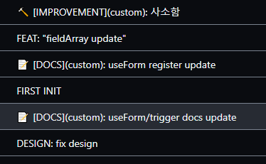

# Gitmoji

## Gitmoji 란?

`gitmoji란` `commit message`를 전송할 때 emoji를 이용해서 작성하는 tool정도로 보면 될 것 같다.<br>

## 사용한 이유

첫 번째 이유로는 프로젝트를 진행하면서 `commit message`를 규격화 하고 싶었다.<br>
어느정도 컨벤션은 만들고 진행했으나 누구는 대문자만 사용하고 누구는 소문자만 쓰고 또 누구는 콜론을 사용하고 누구는 콜론을 안사용하고...
<br>

이러한 부분이 커밋 내역을 지저분하게 만든다고 생각해서 `commit message`를 규격화하는 tool이 필요했다.

두 번째로는 기존에 사용하던 tool의 문제점 떄문이다.<br>
첫 번째 문제를 해결하기 위해 `commitizen`과 `cz`를 사용했다. `Gitmoji` 와 큰 차이는 없었지만 이상하게 commit 메시지에 (custom)이라는 텍스트가 계속 추가됐다.<br><br>


처음에는 개의치 않게 사용했으나 이러한 문제점이 발생하지 않는 tool을 찾았다.<br>
Gitmoji가 `commitizen`의 문제점을 해결해주면서 첫 번째 이유도 해결해 주어 `Gitmoji`를 사용하게 됐다.

## 사용 방법

```shell
npm i -g gitmoji-cli
```

해당 명령어를 통해 설치해주고<br>
`git commit -m "작성할 메시지"` 명령어가 아닌 `gitmoji -c` 명령어로 커밋 메시지를 작성하면 된다.<br><br>


그러면 이렇게 이쁜 커밋 메시지가 작성된다. 그러나 `gitmoji -c`는 어딘가 마음에 안드는 구석이있다.<br>

```json
  "scripts": {
    "test": "echo \"Error: no test specified\" && exit 1",
    "commit": "gitmoji -c"
  },
```

`package.json`에 `commit` 이라는 명령어를 추가해주고 `npm run commit`을 이용해서 `gitmoji`를 사용해주도록 하자

## 문제점

사용해보니 이모티콘 옆에 작성된 텍스트를 같이 커밋메시지에 올려주는 줄 알았는데.... 해당 부분은 없이 이모티콘만 커밋메시지에 올려주었다. 이러면 첫 번째 이슈를 완벽히 해결했다고 볼 수 없기에 실무에서 사용하는건 조금 더 생각해 봐야겠다.