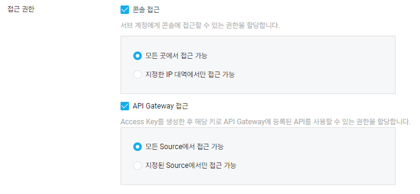

# Next.js 어플리케이션 네이버클라우드 배포

이번에 회사 웹사이트를 만들어야하는 업무를 받았다. 단순히 퍼블리싱만해서 백앤드 개발자에게 넘기는 빠른 방법을 할 수도 있었지만. 나중에 유지보수와 인수인계 같은 부분을 고려했을 때 내가 만드는게 낫다고 판단을 했고 그래도 회사 웹사이트인데 SEO는 필수라고 생각해서 넥스트로 사이트를 생성했다.

우선 빠르게 유저에게 노출해야하기 때문에 우선 CICD 구축은 나중에하기로 하고 노출할 수 있을정도로 만들어둔 웹사이트를 배포하기로했다. 그런데 문제가 익숙하던 AWS가 아니라 네이버클라우드를 사용해야했다. (해당 도메인은 네이버클라우드를 사용하기 때문에)

아무튼 찾아보니까 네이버클라우드에 도커컨테이너를 업로드할 수 있는 `Container Registry` 라는 기능이 있었다 빠르게 이동해서 `레지스티리`를 하나 생성해줬다.

이후 생성한 레지스트리에 도커 이미지를 푸쉬하기 위해 도커파일을 생성해줬다. 뭐 이 부분은 간단하게 생성했다.

```docker
# Step 1: Use an official Node.js runtime as a parent image
FROM node:18

# Step 2: Set the working directory in the container
WORKDIR /usr/src/app

# Step 3: Copy the package.json and package-lock.json (or yarn.lock) files
COPY package*.json ./

# Step 4: Install dependencies
RUN npm install

# Step 5: Copy the rest of the application code
COPY . .

# Step 6: Build the Next.js application
RUN npm run build

# Step 7: Expose port 3000 (default port for Next.js)
EXPOSE 3000

# Step 8: Define the command to run the application
CMD ["npm", "start"]

```

이후 `docker build -t 이미지이름:latest .` 를 이용해서 도커 컨테이너를 생성하고 로컬에서 잘 작동하는 것을 확인했다.

다음 단계로 cli로 해당 레지스터리에 로그인을 하려고했는데 여기서 처음에 막혔다. 나는 로그인할 때 네이버 클라우드 계정으로 로그인하려고 했는데 해당 계정으로는 로그인이 안됐다. 이유를 확인하고 싶어서 이런저런 이유를 알아봤는데 생각보다 이유는 단순했다.

내 SUB계정을 만들어 줄 때 `API Gateway` 접근 권한을 안열어줬기 때문이다,,,,, 그래서 새로 Sub Account를 생성해주고 API Gateway 접근권한을 열어줬다.



이 부분을 해줘야했음 ,,,,,

그리고 필요한 권한들을 부여해주고 (레지스터리에 이미지 푸쉬할수있는 권한) Access Key를 이용해서 로그인을 완료했다.

그리고 이미지를 푸쉬 했는데 자꾸 해당 이미지가 없다는 이유로 push가 안됐다. 이 부분 또한 확인해보니까 이미지에 태그를 붙여서 해당 태그 네임으로 푸쉬를 해야했었다.

이부분도

```bash
docker tag 로컬에서빌드한이미지 레지스터리주소/로컬에서빌드한이미지
docker push 레지스터리주소/로컬에서빌드한이미지
```

이렇게 작성하니까 해당 이미지가 레지스터리에 푸쉬가 완료됐다.
