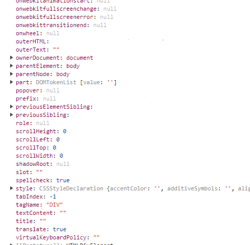

# Component, Elements and Instances

## 학습 목표

세가지 개념은 익숙한 것처럼 보이지만 실제로 사용할 때는 그 차이를 정확히 구분하지 못하고 있다. 그렇기 때문에 각각의 개념을 자세히 살펴보고 각 요소들의 관계는 무엇이고 서로 어떤 영향을 주고 받는지 학습하여, 추후 `reconciliation`이나 `fiber architecture` 같은 `react`의 개념을 이해하는 것을 학습 목표로 한다.

_해당 개념은 Dan Abramov가 작성한 [블로그 글](https://medium.com/@dan_abramov/react-components-elements-and-instances-90800811f8ca)을 참조하였다._

## Managin the Instance

### 기존 UI model (OOP)

기존 ui model을 객체 지향으로 작성해 놓은 pseudo code 이다

```tsx
class Form extends TraditionalObjectOrientedView {
  // form 클래스
  render() {
    // Read some data passed to the view
    const { isSubmitted, buttonText } = this.attrs; // 해당 속성값을 받아와서
    if (!isSubmitted && !this.button) {
      // Form is not yet submitted. Create the button!
      this.button = new Button({
        // 해당 클래스를 호출해서 생성한 인스턴스를 할당 중
        children: buttonText,
        color: "blue",
      });
      this.el.appendChild(this.button.el); // appendChild를 이용해서 dom에 mount중
    }

    // 우리가 직접호출한 button이란 instance를 가지고 destory했다 reunder했다 한다.

    if (this.button) {
      // The button is visible. Update its text!
      this.button.attrs.children = buttonText;
      this.button.render();
    }
    if (isSubmitted && this.button) {
      // Form was submitted. Destroy the button!
      this.el.removeChild(this.button.el);
      this.button.destroy();
    }
    if (isSubmitted && !this.message) {
      // Form was submitted. Show the success message!
      this.message = new Message({ text: "Success!" });
      this.el.appendChild(this.message.el);
    }
  }
}
```

### 한계점

`componet` 가 점점 많아지면 각 컴포넌트에 속한 Button 같은 `instance` 도 점점 더 많아진다. 즉 각 `component` 는 `DOM node`의 주소와 자식 `component`의 `instance` 주소를 보관 해야 한다.

또한 각 `instance` 를 적절한 시점에 `appendChild`, `remove`, 그리고 `destroy` 같은 메서드를 사용 해야 하는 문제점이 발생한다. 이러면 관리할 코드가 굉장히 늘어나고 `component` 코드도 굉장히 복잡해진다.

또한 `Form`이란 부모 컴포넌트가 직접 자식 컴포넌트에 접근하고 있다. 이러면 `decouple` 하기가 굉장히 어렵다.

**_이러한 문제점을 해결하기 위해 React는 Element라는 개념을 활용했다._**

## Elements Describe the Trees

`DOM tree` 를 그리기 위해 필요한 정보들을 `Describe` 해주는 `tree`를 작성했다.

### Elements

- `DOM node`에 대한 정보를 가지고 있는 `plain object`이다.
- `instance` 가 아니며 단지 `react` 에게 브라우저가 무엇을 그릴지 알려줄 뿐이다.
- `element`가 생성이 되면 두 가지 `filed`를 가진다 `(type: string | ReactClass, props: object)`
  - 어떤 때에 `type`에 `string`이 할당되고 또 어떤 때에 `ReactClass`가 할당될까? ⇒ 그것은 `elements` 종류에 따라 달라진다. 두 가지 종류에 대해 살펴보도록 하자
  - 즉 `element` 는 두 가지 종류가 있다고 보면 된다.

### **React DOM elements**

```tsx
{
  type: 'button', // type에 button이라는 string 이 할당됨 button은 html 태그의 이름
								  // 그래서 tag의 이름이 string 이기 때문에 이 dom element에는 type에
								  // button string 값 할당 즉 string이 할당되는 경우는 dom element일 때
  props: {
    className: 'button button-blue',
    children: {
      type: 'b',
      props: {
        children: 'OK!'
      }
    }
  }

	// dom element 일 경우에는 html 속성값들이 props에 할당됨.

}
<button class='button button-blue'>
  <b>
    OK!
  </b>
</button>
```

- 단순한 객체이기 때문에 `DOM elements`보다 가볍다
  - 여기서 말하는 `DOM elements`는 아래와 같은 객체를 의미
  - 
- 파싱할 필요 없고 쉽게 탐색 가능하다

그러면 `reactClass`가 할당 될 때는 언제일까?

- `reactClass` 타입은 `React Component elements` 라고 보면 된다.

### **React Component elements**

```tsx
{
  type: Button, // class component가 할당 (함수형도 가능)
  props: {
    color: 'blue',
    children: 'OK!'
  }

	// component element가 결국엔 dom tree에 어떤 정보를 전달해야 표현이될지,
	// 브라우저가 해당 dom tree를 가지고 rendering 할 수 있을지에 대한 정보

}
```

즉 `DOM elements` 나 `Component elements` 모두 `DOM tree`에게 전달할 정보를 가지고 있다.

### React team에서는 기존의 OOP 모델에서 element라는 모델로 전환하면서 어떻게 기존의 모델이 가지고 있는 한계를 극복했는가?

`Compoent elements`의 `props` 를 자세히 보면 다른 `element` 를 `children` 으로 가질 수 있게 구조가 되어있다. (그래서 tree 구조가 가능함) 그러므로 `React Component elements` 와 실제 `DOM`에 가장 비슷한 `React DOM elements` 가 같은 위계에서 관리가 가능해진다.

쉽게 말하면 우리가 `React` 에서 코드로 구현한 `Component`와 실제 `DOM`에 있는 `elements` (여기서는 `React DOM Elements`를 의미하는데 `React DOM elements`는 실제 `DOM elements`의 정보를 전부 가지고 있다고 봐도 무방)

어떻게? `elements` 란 개념을 `react team`에서 도입 함으로써

한마디로 정리하면 `element` 에 의해 기존의 `DOM node`와 `React Component` 를 `mixed, nested`한 구조가 가능해짐

조금 더 자세하게 코드로 살펴보자

```tsx
const DeleteAccount = () => ({ // 해당 함수는 현재 element를 return하고 있다.
  type: 'div', // div가 html tag이기 때문에 해당 element의 type 은 div가 됨
  props: {
		// 그리고 children에 p tag 같은 html 태그가 있고
    // DangerButton 처럼 우리가 선언한 component 도 있다
		// 이는 마치 html tag 마냥 관리되고 있다,
		// 즉 완전히 nested, mixed 가 가능하다는 의미
    // 이는 즉 컴포넌트들끼리 완전히 decoupled가 가능하다라는 의미
		// decoupled라는 의미는 예를들에 아래에 Button이 우리는 단순히 있다는 거만 알지 해당
    // 컴포넌트가 언제 update되고 remove되야하는지는 우리는 모른다.
    children: [{
      type: 'p',
      props: {
        children: 'Are you sure?'
      }
    }, {
      type: DangerButton,
      props: {
        children: 'Yep'
      }
    }, {
      type: Button,
      props: {
        color: 'blue',
        children: 'Cancel'
      }
   }]
});
const DeleteAccount = () => (
  <div>
    <p>Are you sure?</p>
    <DangerButton>Yep</DangerButton>
    <Button color='blue'>Cancel</Button>
  </div>
);
```

### **Components Encapsulate Element Trees**

`Components` 는 `element` 를 `return` 하는 함수일 경우에 해당 `element` 는 `DOM tree` 에 전달할 정보를 프로퍼티로 가지고 있는 자바스크립트 객체이다.

즉 우리가 일반적으로 `React` 에서 작성한 코드(JSX)들은 결국 위의 `element` 들을 자바스크립트 객체로 `return` 해준다.

해당 `element tree` 즉 자바스크립트 객체에는 `DOM tree`에 전달할 정보만 `캡슐화` 되어있다.

또한 해당 컴포넌트들이 언제 렌더링 되고 지워지는지는 `React`가 해당 `elements` 들을 보고 알아서 해준다.

그러면 `react`는 `Component elements` 를 만났을 때 어떻게 하냐?

```tsx
{
  type: Button,
  props: {
    color: 'blue',
    children: 'OK!'
  }
}
// React는 Button을 만나면 Button이란 컴포넌트를 찾는다. 해당 컴포넌트는 아래의 element를
// return 하는데 Button 컴포넌트는 dom element를 리턴한다. 그러면 해당 element는 DOM tree에
// 어떤 정보를 표시해야하는지 전부 나와있다.
{
  type: 'button',
  props: {
    className: 'button button-blue',
    children: {
      type: 'b',
      props: {
        children: 'OK!'
      }
    }
  }
}
```

즉 `react` 는 `React Component elements` 를 만나면 해당 컴포넌트가 `React DOM elements` 를 `return` 할 때 까지 이러한 과정을 반복한다.

즉 모든 `Component` 가 `React DOM elements` 를 `return` 할 때 까지 이 과정을 반복한다.

그러면 `DOM elements` 만 가지고 있는 `elements tree` 를 `react` 가 알게 된다 그렇게 되면 `react` 입장에서는 `dom tree` 에다가 어떤 정보를 전달 해야 할지 알기 때문에 그 정보를 바탕으로 `creat`, `update`, `destroy`를 따로 한다.

그리고 우리가 작성한 `component` 는 `dom tree` 에 전달할 정보만 작성하는 것 이다. 이렇게 `component` 에 의해서 `elements tree` 가 `encapsulate` 됐고 `react` 는 이러한 `elements` 를 토대로 `creat`, `update`, `destroy` 한다.

이러한 방법으로 인해 기존의 `Form Modeling (UI model (OOP))` 을 아래와 같이 간단하게 구현할 수 있다.

```tsx
const Form = ({ isSubmitted, buttonText }) => {
  if (isSubmitted) {
    // Form submitted! Return a message element.
    return {
      type: Message,
      props: {
        text: "Success!",
      },
    };
  }
  // Form is still visible! Return a button element.
  return {
    type: Button,
    props: {
      children: buttonText,
      color: "blue",
    },
  };
};
```

이처럼 `React element` 를 활용하여, 기존의 `DOM structure` 을 모두 활용하지 않고, 필요한 정보만 독립적으로 UI 를 관리 할 수 있게 됐다.

### 정리

`elements`는 결국 `DOM tree` 에게 전달할 정보를 가지고 있는 `javascript` 객체이다. 그러면 그 객체가 `elements tree` 를 만들면 `react`가 해당 `tree` 를 알고 있다. 그러면 `react`는 해당 `elements tree` 를 보면서 이 `element` 들이 실제 `dom tree`에 `render` 하고 `destroy` 하는 것을 알고 알아서 수행한다.

그러면 `Component`는 무엇이냐?

자바스크립트 `function` 에서 인자는 `props` 이고 `return` 은 (jsx문법을 return하면) `elements` 를 리턴하는 것이다.

class 형에서는 `render` 라는 `method` 에서 `elements` 를 `return` 하는 것 이다. 그리고 `lifecycle` 이나 `state` 도 접근 가능하다.

`hooks` 도입 전에는 함수형에서 `lifecycle` 접근이 어려웠지만 `hooks` 도입 이후 완전히 가능함.

## Top-Down Reconciliation

```tsx
ReactDOM.render(
  {
    type: Form,
    props: {
      isSubmitted: false,
      buttonText: "OK!",
    },
  },
  document.getElementById("root")
);
```

`ReactDOM.render` 라는 함수를 호출하게 되면 결국 `react` 는 `Form` 이라는 `Component` 에게 물어본다. `props` 객체에 있는 값들을 전달하면서.

그러면 `Form` 은 `Button` 이란 컴포넌트 `element` 를 `return` 하게 되고 해당 컴포넌트 `element` 에서는 `type` 이 `Button` 이기 때문에 `React DOM elements` 를 `return` 할 때 까지 한번 더 보게 된다. 그러면 `Button component`가 `React DOM elements`를 `return` 한다.

`React DOM elements` 는 `DOM tree` 와 직접적인 연관이 있는 `elements` 이기 때문에 바로 `rendering` 가능하다.

```tsx
// React: You told me this...
{
  type: Form,
  props: {
    isSubmitted: false,
    buttonText: 'OK!'
  }
}
// React: ...And Form told me this...
{
  type: Button,
  props: {
    children: 'OK!',
    color: 'blue'
  }
}
// React: ...and Button told me this! I guess I'm done.
{
  type: 'button',
  props: {
    className: 'button button-blue',
    children: {
      type: 'b',
      props: {
        children: 'OK!'
      }
    }
  }
}
```

이러한 과정을 우리는 **Top-Down Reconciliation** 이라고 한다.

- `ReactDom.render()`, `setState()` 호출 시 `React call reconcilation` 한다. `reconcilation` 이 끝나면 React 는 `elements tree`를 알게되며 해당 `tree` 를 `renderer` 에게 전달하고 이 `renderer` 가 필수적인 최소한의 변화를 DOM node 업데이트에 적용
- 또한 위와 같은 점진적 변화 때문에 쉽게 최적화가 가능하다. 또한 `props` 가 `immutable` 이면 변화의 계산은 더 빠르다.
- `React` 가 `class componet` 의 `Instance` 를 만들어 준다. (여기서는 `class Component` 의 `instance` 를 의미한다)

## Summary

- `component`, `element`, `instance` 중 가장 자세하게 살펴봐야 하는 항목은 `element`
  - `element` 는 `react component` 와 `dom element` 로 나뉘어지고 `dom element` 로만 구성 될 때 까지 `component element` 에게 물어본다.
- 그리고 `dom elements` 로만 `tree` 가 만들어지면 해당 `tree` 를 가지고 실제 `dom tree` 에 적용해서 `dom node tree` 를 완성해서 브라우저에 렌더링 한다.
- `component` 는 그 `component` 가 함수형일 경우 해당 함수가 `return` 해주는 거고 `calss` 형에서는 `render` 라는 메서드가 return 해준다.
- `instance` 는 `class` 컴포넌트 안에서의 `this` 값이라고 이해하자
