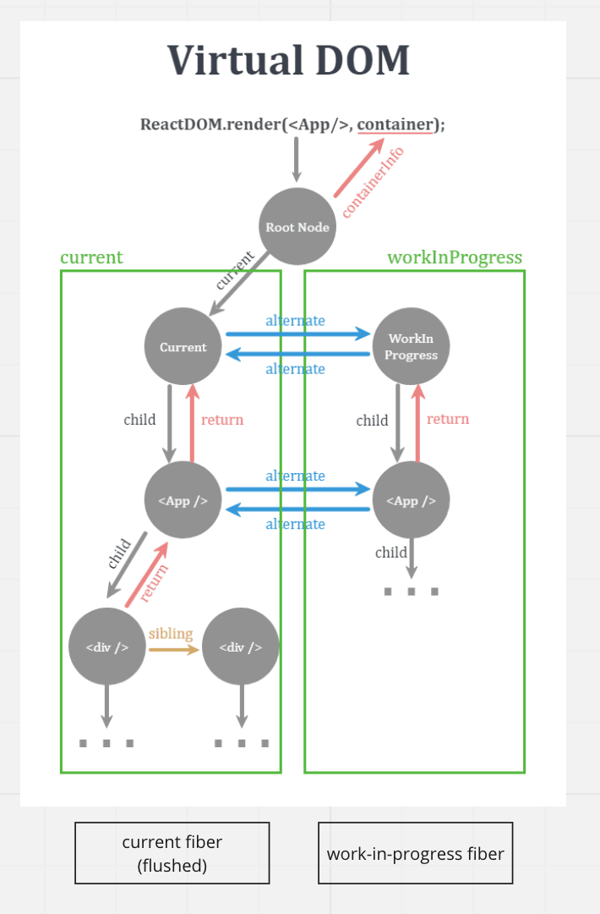
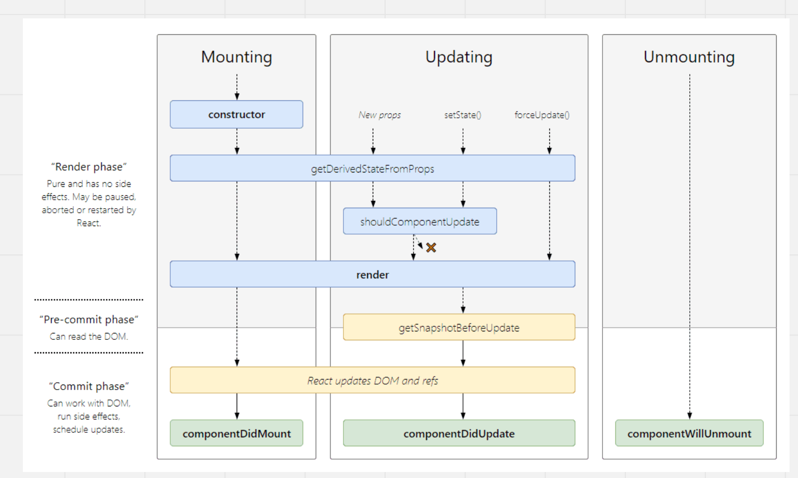

# 3. render phase 와 commit phase 를 비교하여 Virtual DOM 동작 원리 살펴보기

## what is virtual DOM?

- 결국은 프로그램 컨셉이다.
- 메모리에 우리가 프로그램에 필요한 핵심 정보를 띄우고 `react-dom` 과 같은 `renderer` 패키지가 실제 `DOM`과 우리가 띄운 정보의 싱크를 맞추는 것 이다.
- 이러한 전체적인 과정을 `Reconciler` 가 담당해서 한다.
- 그러면 왜 가상이지?
  - `DOM`을 조작하고 조작한 `DOM`을 가상이 아닌 실제로 한다면 비용이 너무 많이든다.
  - 그래서 더 빨리 수행하기 위해서 `VDOM`이란 컨셉을 도입

## how wors virtual DOM?

- 해당 그림에서 `node` 들은 `dom tree node` 에서 `fiber node` 로 변경됐다.
- `current tree` 와 `workInProgress tree` 두 개를 가진 더블 버퍼링 구조를 가진다.
- **current tree**
  - `DOM` 에 `mount` 된 (아직 `paint` 아님) 정보들을 `fiber node` 로 표현한 것
- **workInProgress**
  - 현재 작업 중인 `tree`
  - 어떻게 만들어지냐? ⇒ `current` 에서 자기 복제를 해서 만들어진다.
  - 해당 `tree` 도 동일하게 `fiber node` 로 구성되어 있다.
  - 서로 `alternative` 를 이용해서 참조하고 있다.
    - `fiber node` 는 모두 자바스크립트 객체인데 각 객체 안에 `alternative` 라는 `key` 를 가지고 있고 해당 `key` 의 `value` 값으로 객체 레퍼런스가 담겨져 있다.
  - `render phase` 에서 작업 중이다. `render phase` 에서 작업이 끝나면 `commit phase` 로 이동하는데 여기서 `workInProgress tree` 는 `current tree` 가 된다.
    - 이게 무슨 소리냐? 할 수 있는데 `workInProgress tree` 와 `current tree` 는 가지고 있는 정보가 동일하다. 그러므로 Root Node에서 `current tree` 로 이어진 참조가 끊어지고 `workInProgress` 로 참조를 연결하므로 `workInProgress` 가 `current tree` 가 되는 것이다. 그러면 `workInProgress` 가 `current tree` 가 되어 다시 하나를 더 자기 복사하여 그 복사본이 `workInProgress` 가 된다. 이런 식으로 서로 생성과 삭제가 지속적으로 이루어진다.
    - 이처럼 똑같은 구조를 가지고 있는 구조를 더블 버퍼링 구조라고 한다.
    - 그렇다면 왜 더블 버퍼링 구조를 가지게 됐느냐?
      - 순서를 유연하게 가져가기 위해 원본과 복사본을 두는 것이다.

## React lifecycle

### render phase

- VDOM 재조정 (reconciliation) 하는 단계
  - `fiber node` 로 확장된 자바스크립트 객체가 추가되거나 수정 삭제되는 것을 의미힌다.
  - 이 때 `reconciliation` 이 일어나기 위해서는 `WORK` 를 `scheduler` 에 등록해야한다.
    - `scheduler` 은 또 다른 패키지다.
    - `WORK` 란 ? ⇒ `reconciliation` 가 컴포넌트의 변경을 DOM 에 적용하기 위해서 수행하는 작업
  - 쉽게 얘기하면 `reconciliation` 에 `scheduler` 라는 패키지에 `WORK` 를 등록하는데 이 등록된 `WORK` 를 `scheduler` 가 타이밍 맞게 실행하는 역할을 담당한다.
  - 이러한 전체적인 과정을 `reconciler` 가 담당한다
  - `reconciler` 가 큰 변화를 가져옴
    - 버전 `16` 부터 `stack` 에서 `fiber` 로 변경돼 렌더링의 순서를 변경할 수 있게 됐다.
    - 왜냐면 `stack` 은 `FILO` 이지만 `fiber` 는 순서에 상관이 없다. 그래서 `abort`, `stop`, `restart` 등의 메서드를 호출하면서 멈출 수도 다시 시작할 수 도 있다
      - ex) useTransation

### commit phase

- `reconciliation` 끝난 DOM을 VDOM에 적용 그리고 라이프사이클을 실행
- 해당 VDOM 을 DOM 에 적용하기 위해서 일괄적으로 적용하기 위해서 동기적으로 적용 즉 DOM을 일괄 조작 처리 후, 리액트가 콜스택을 비워준 다음 브라우저가 paint 시작
