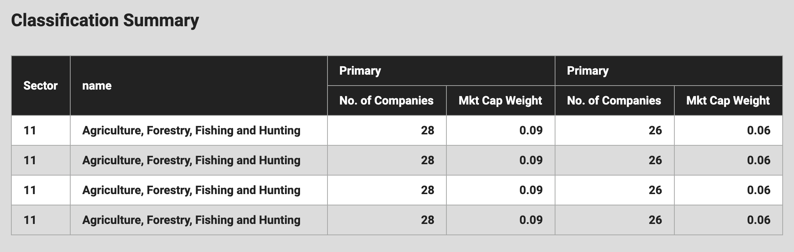

# Tanstack Table (React Table)

## 사용 배경

기존에 테이블 컴포넌트를 제작할 때는 직접 table 관련 태그들을 사용하여 제작했다. 단순한 데이터를 보여주는 목적으로는 어렵지 않게 작업할 수 있는 컴포넌트지만 테이블에는 클라이언트가 원하는 다양한 기능이 추가될 가능성이있다 (ex 셀 옮기기, 필터링, 페이지네이션 등등) 이러한 기능들을 직접 제작할 수도 있지만 필요한 기능들이 내장된 라이브러리를 이용하여 빠르고 구조적인 컴포넌트 설계를 위해서 `Tanstack table` 을 도입했다.

## 기본 컨셉

> 사실 Tanstack Table 의 도큐가 친절한 편은 아니다 이는 비단 Table 뿐만 아니라 Tanner Linsley 가 운영하는 TanStack 의 대부분 라이브러리들이 마찬가지인데 그래도 나름 파악한 구조를 통해서 기본 컨셉에대해 설명해보겠다.

```tsx
const table = useReactTable({
  data,
  columns,
  getCoreRowModel: getCoreRowModel(),
  enableColumnResizing: true,
  columnResizeMode: "onChange",
});
```

useReactTable 훅을 이용해서 리턴되는 객체를 이용해서 테이블 컴포넌트를 만든다고 생각하면 편하다 리턴되는 객체에는 Tanstack 테이블이 제공해주는 여러 기능들을 가지고있는 객체이며 필요한 기능은 해당 객체의 메서드를 이용해서 구현하면 된다.

그러면 테이블 컴포넌트를 설계하는 과정을 살펴보도록하자

## 제작 과정

우선 해당 테이블에 필요한 `column` 을 설계해야한다. Tanstack table 은 최초 설계된 column 구조와 전달되는 data 객체의 맵핑을 통해서 내가 직접 데이터를 셀에 렌더링하는 것이 아니라 자동으로 data 객체에서 일치되는 column 값에 맞는 셀에 렌더링 되게 해준다. 그러므로 최초 column 을 설계하는 과정이 가장 중요하다.

만약 단순하게 헤더가 1행이면 어렵지 않게 설계할 수 있다. 하지만 이 세상은 그렇게 단순한 테이블만 존재하지 않는다. 어떤 테이블들은 헤더가 2행 혹은 3행까지 가지는 복잡한 헤더 구조를 가질 수 있다. 이 경우 기존의 방식대로 컴포넌트를 제작했다면 매번 새로운 테이블 헤더를 작성해줘야 할 것이다 (물론 이러한 방법이 틀린 것은 아니다 오히려 children 으로 전달하여 더 빠르고 직관적으로 만들 수도 있다고 생각한다.) 하지만 Tanstack 테이블은 이러한 복잡한 테이블을 그룹핑하여 매번 작성하는 것이 아닌 설계된 column 배열을 전달하여 선언적으로 작성 할 수 있다 가령 아래와 같은 테이블을 살펴보자



상단의 테이블은 2열 까지는 행이 나눠지지 않았지만 3열부터 2행으로 나눠지고 헤더가 그룹핑되어있다. 이러한 헤더는 (뿐만 아니라 보통의 헤더 역시) `columns` 객체를 Tanstack 테이블이 제공해주는 `createColumnHelper<ClassificationSummaryType>();` 를 통해서 쉽게 제작할 수 있다.

아래 코드를 살펴보자

```tsx
const columns = [
  columnHelper.group({
    id: "sector",
    header: () => <span>Sector</span>,
    meta: {
      rowSpan: 2,
    },

    columns: [
      columnHelper.accessor("sector", {
        header: () => <span></span>,
        meta: {
          hide: true,
        },
      }),
    ],
  }),
  columnHelper.group({
    id: "name",
    header: () => <span>name</span>,
    meta: {
      rowSpan: 2,
      width: "w-1/3",
    },
    columns: [
      columnHelper.accessor("name", {
        header: () => <span></span>,
        meta: {
          hide: true,
        },
      }),
    ],
  }),
  columnHelper.group({
    id: "Primary",
    header: () => <span>Primary</span>,
    columns: [
      columnHelper.accessor("primaryNoOfCompanies", {
        header: () => <span>No. of Companies</span>,
        meta: {
          additionalClassName: "text-right",
        },
      }),
      columnHelper.accessor((row) => row.primaryMktCapWeight, {
        id: "primaryMktCapWeight",
        cell: (info) => info.getValue(),
        header: () => <span>Mkt Cap Weight</span>,
        meta: {
          additionalClassName: "text-right",
        },
      }),
    ],
  }),
  columnHelper.group({
    id: "Secondary",
    header: () => <span>Primary</span>,
    columns: [
      columnHelper.accessor("secondaryNoOfCompanies", {
        header: () => <span>No. of Companies</span>,
        meta: {
          additionalClassName: "text-right",
        },
      }),
      columnHelper.accessor((row) => row.secondaryMktCapWeight, {
        id: "secondaryMktCapWeight",
        cell: (info) => info.getValue(),
        header: () => <span>Mkt Cap Weight</span>,
        meta: {
          additionalClassName: "text-right",
        },
      }),
    ],
  }),
];
```

우선 해당 테이블 헤더는 그룹핑이 존재하기 때문에 그룹핑이 된 열부터 제작해준다

```tsx
 columnHelper.group({
    id: "Secondary",
    header: () => <span>Primary</span>,
    columns: [
      columnHelper.accessor("secondaryNoOfCompanies", {
        header: () => <span>No. of Companies</span>,
        meta: {
          additionalClassName: "text-right",
        },
      }),
      columnHelper.accessor((row) => row.secondaryMktCapWeight, {
        id: "secondaryMktCapWeight",
        cell: (info) => info.getValue(),
        header: () => <span>Mkt Cap Weight</span>,
        meta: {
          additionalClassName: "text-right",
        },
      }),
    ],
  }),
```

`columnHelper` 의 `group` 메서드를 이용해 인자로 특정한 객체를 전달해준다
id 프로퍼티에는 해당 그룹의 이름을 정해주고 `header` 값에는 실제로 dom에 렌더릴 될 html 값을 리턴해준다.

이후 그룹핑된 두번째 행은 2개의 열이 존재하기 때문에 colums 프로퍼티에 객체를 전달해준다.

여기서 한가지 중요한점은 `createColumnHelper` 함수를 호출 할때 우리가 제네릭으로 제작해야할 테이블의 타입을 제네릭으로 전달해주었다는 점이다.

```tsx
type ClassificationSummaryType = {
  sector: number;
  name: string;
  primaryNoOfCompanies: number;
  primaryMktCapWeight: number;
  secondaryNoOfCompanies: number;
  secondaryMktCapWeight: number;
};

// what is this?
const columnHelper = createColumnHelper<ClassificationSummaryType>();
```

그렇기 때문에 `columnHelper.accessor` 메서드를 사용 할 때 직접 우리가 키 값을 입력 해줄 수도 있지만 해당 메서드의 콜백함수를 이용하는 방법도 있다 (이는 공식문서에 있는 방법)

```tsx
 columnHelper.group({
    id: "Secondary",
    header: () => <span>Primary</span>,
    columns: [
      columnHelper.accessor("secondaryNoOfCompanies", {
        header: () => <span>No. of Companies</span>,
        meta: {
          additionalClassName: "text-right",
        },
      }),
      columnHelper.accessor((row) => row.secondaryMktCapWeight, {
        id: "secondaryMktCapWeight",
        cell: (info) => info.getValue(),
        header: () => <span>Mkt Cap Weight</span>,
        meta: {
          additionalClassName: "text-right",
        },
      }),
    ],
  }),
```

해당 코드를 비교해보면 1열에 있는 `secondaryNoOfCompanies` 값은 직접 입력해주었지만 2열에 있는 `secondaryMktCapWeight` 값은 콜백함수의 인자로서 받아온 부분을 확인 할 수 있다.

사실 구현목적에 맞는 방법은 `accessor` 첫번 째 인자값에 직접 스트링으로 입력해주는 방법이다 왜냐면 아래의 방법은 공식홈페이지에 있는 방법이지만 어짜피 `id` 값에 직접 특정한 스트링을 넣어주어야 한다는 점이다 (첫번 째 인자값에 넣어주지 않으면 id를 넣어주라고 한다) 콜백함수에서 전달해주는 인자는 실제로 전달해주는 data의 값을 각 행별로 확인할 수 있을 뿐이다.

이런 부분이 나는 도큐가 불친절하다고 느끼는 부분이다. 다양한 방법이 있는건 좋은부분이지만 어떤 방식으로 만들어야 하는지는 길라잡이를 해주지 않기때문이다. 물론 이는 개발자의 숙몀이기 때문에 내가 직접 사용해보면서 방법을 찾아갈 수 밖에 없는 부분도 동의한다.

각설하고 결국 중요한 부분은 우리가 `accessor` 인자값에 직접 식별가능한 스트링을 넣어주던가 혹은 두번째 인자로 전달하는 객체의 `id` 프로퍼티에 해당 값을 넣어주어야한다,

이후 `header` 프로퍼티는 마찬각지로 실제 dom에 렌더링되는 html을 넣어주면된다.

그러면 여기서 `cell` 프로퍼티는 도대체 뭔데? 라는 질문을 할 수 있다. `cell` 프로퍼티를 설명하기전 해당 프로퍼티에 걸린 콜백함수의 인자값 부터 확인해보겠다 해당 인자값은 해당 테이블을 조작할 수 있는 프로퍼티와 메서드들이 담겨있는 객체라고 생각하면 편하다. 이는 즉 위에서 말했던 테이블에 필요한 기능들을 구현할 수 있는 객체인데 사실 단순한 헤더만 제작한다고 생각하면 반드시 필요한 프로퍼티는 아니라고 볼 수 있다. (그 이유는 header 프로퍼티를 통해서 헤더 엘리먼트를 구현할 수 있기 때문이다.)

하지만 cell 자체는 해당 헤더의 dom 자리에 렌더링되는 기능을 제공하는 프로퍼티는 맞다
가령 위의 코드에서 `info.getValue()` 는 `accessor` 첫번째 인자값에 들어오는 스트링을 받아서 렌더링 해주는 것이다. 즉 header 프로퍼티를 사용하지 않고 dom 에 렌더링 할 수 있는 것 이다.

아까와 마찬가지로 이런부분이 도큐가 불친절하다고 느끼는 지점인데 이러한 부분은 다양한 기능을 구현하면서 사용법을 익힐 필요가 있다고 생각한다.......

사실 그룹핑한 헤더는 조금 복잡하다고 느낄 수 있지만 단순한 1행짜리 헤더는 그렇게 어렵지 않다. 아래 코드를 살펴보자

```tsx
type CompaniesClassifiedType = {
  no: number;
  company: string;
  ticker: string;
  exchange: string;
  figiComposite: string;
  figiGlobalShareClass: string;
};

const columns = [
  columnHelper.accessor("no", {
    id: "no",
    cell: (info) => info.getValue(),
    header: () => <span>No.</span>,
  }),
  columnHelper.accessor("company", {
    id: "company",
    cell: (info) => info.getValue(),
    header: () => <span>Company</span>,
  }),
  columnHelper.accessor("ticker", {
    id: "ticker",
    cell: (info) => info.getValue(),
    header: () => <span>Ticker</span>,
  }),
  columnHelper.accessor("exchange", {
    id: "exchange",
    cell: (info) => info.getValue(),
    header: () => <span>Exchange</span>,
  }),
  columnHelper.accessor("figiComposite", {
    id: "figiComposite",
    cell: (info) => info.getValue(),
    header: () => <span>FIGI Composite</span>,
  }),
] as ColumnDef<CompaniesClassifiedType, unknown>[];
```

물론 해당 코드도 굳이 cell을 사용할 필요는 없다. 하지만 특정한 로직을 통해서 헤더를 작성하고 싶다면 cell 프로퍼티를 사용하도록 하자

또한 마지막으로 중요한 부분은 `meta` 라는 객체이다 meta는 Tanstack 이 제공해주는 프로퍼티나 메소드가 아닌 사용자가 임의로 추가하는 값을 table 인스턴스에서 사용할 수 있게 해주는 객체라고 생각하면된다. 예를들어 아래의 코드를 보면

```tsx
{
   id: "sector",
    header: () => <span>Sector</span>,
    meta: {
      rowSpan: 2,
    },

    columns: [
      columnHelper.accessor("sector", {
        header: () => <span></span>,
        meta: {
          hide: true,
        },
      }),
    ],
}

```

부분을 확인할 수 있는데 meta 객체로 전달된 값들은 아래의 코드 처럼 사용할 수 있다

```tsx
{
  table.getHeaderGroups().map((headerGroup) => {
    return (
      <tr key={headerGroup.id}>
        {headerGroup.headers.map((header) => {
          const hide = header.column.columnDef.meta?.hide;
          const rowSpan = header.column.columnDef.meta?.rowSpan;
          const width = header.column.columnDef.meta?.width;
          if (hide) return;
          return (
            <th
              key={header.id}
              rowSpan={rowSpan && rowSpan}
              colSpan={header.colSpan}
              className={cn(
                thBasicClass,
                width && width,
                scroll && "break-words"
              )}
            >
              {flexRender(header.column.columnDef.header, header.getContext())}
            </th>
          );
        })}
      </tr>
    );
  });
}
```

`flexRender`에 해당 값을 넣어주면 cell 혹은 header 프로퍼티에 넣어준 값이 렌더링 된다.

물론 meta 태그에서 본인이 작성한 부분 (rowSpan, hide) 같은 값들을 Tanstack 테이블이 제공하지만 내가 못찾은 부분이 있을 수도 있다 이러한 부분은 해당 컴포넌트를 더 리팩토링하면서 찾아가보도록 하겠다.

이제 제작한 헤더에 맞추어 실제 데이터를 뿌려주어야한다 해당 데이터는 `useReactTable` 의 인자값으로 받는 객체에 column 프로퍼티에 전달해주면 된다. 대신 해당 데이터를 전달할 떄 헤더에 작성한 `id` 값 혹은 `accessor` 메서드 인자에 전달해준 스트링 값과 실제 매칭시켜줄 데이터의 키값이 동일해야 한다 예를들면

```tsx
const tableData: CompaniesClassifiedType[] = [
  {
    no: 1,
    company: "Apple Inc",
    ticker: "AAPL",
    exchange: "Nasdaq Stock Market",
    figiComposite: "BBG000B9XRY4",
    figiGlobalShareClass: "BBG001S5N8V8",
  },
  {
    no: 1,
    company: "Apple Inc",
    ticker: "AAPL",
    exchange: "Nasdaq Stock Market",
    figiComposite: "BBG000B9XRY4",
    figiGlobalShareClass: "BBG001S5N8V8",
  },
  {
    no: 1,
    company: "Apple Inc",
    ticker: "AAPL",
    exchange: "Nasdaq Stock Market",
    figiComposite: "BBG000B9XRY4",
    figiGlobalShareClass: "BBG001S5N8V8",
  },
  {
    no: 1,
    company: "Apple Inc",
    ticker: "AAPL",
    exchange: "Nasdaq Stock Market",
    figiComposite: "BBG000B9XRY4",
    figiGlobalShareClass: "BBG001S5N8V8",
  },
  {
    no: 1,
    company: "Apple Inc",
    ticker: "AAPL",
    exchange: "Nasdaq Stock Market",
    figiComposite: "BBG000B9XRY4 ^^",
    figiGlobalShareClass: "BBG001S5N8V8",
  },
];
```

해당 데이터가 실제 테이블에 뿌려질 때는 각 객체 프로퍼티의 `key`값과 매칭되는 열에 맞추어 렌더링된다.

## 후기

단순히 데이터를 뷰 하는 테이블 만들 때는 해당 컴포넌트를 이용해서 만들어주면 기존의 방법보다 더 구조적, 선언적으로 만들수 있게 됐다. 물론 이러한 제작을 위해서는 백엔드 개발자가 프론트 개발자간 주고받는 데이터의 자료구조를 확실히 해야할 필요가 있다.

또한 해당 컴포넌트는 아직 추가적인 기능이 누락된 반쪽자리 컴포넌트이다. 앞으로 해당 컴포넌트를 리팩토링 및 기능을 추가하여 조금 더 범용적으로 사용할 수 있는 컴포넌트를 제작하도록 하겠다.
