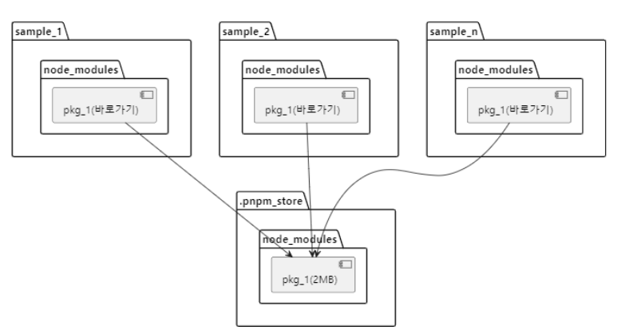

# 패키지 매니저란?

# 0. 작성 배경

자바스크립트로 어떠한 애플리케이션을 만들 때 우리는 너무 나도 자연스럽게 패키지 매니저를 사용한다. (그중에서도 본인은 npm을 제일 많이 사용했음)

하지만 패키지 매니저란 정확히 무엇인지 또 다른 패키지 매니저가 무엇인지 또 그 차이점에 대해서는 자세히 알지 못한다.

이번 기회에 패키지 매니저란 무엇이고 패키지 매니저의 종류와 각 차이점에 대해서 학습해보도록 하자.

# 1. 패키지 매니저란?

## 정의

소프트웨어를 개발 할 때 라이브러리나 프레임워크와 같은 외부 패키지의 사용 및 관리는 필수적이다. 이러한 패키지 사용과 관리를 용이하게 해주는 도구가 바로 패키지 매니저다.

다양한 언어 진영에서 패키지 매니저가 사용되지만 (파이썬의 pip, ruby의 rubygems 등) 현재 본인이 사용하고 있는 node.js 진영에서는 npm, yarn, pnpm 등 다양한 패키지 매니저가 존재한다.

이러한 패키지 매니저는 수많은 자바스크립트 라이브러리와 프레임워크 도구를 관리할 수 있다.

## 사용 이유

패키지 매니저를 사용하는 이유는 다양한 라이브러리를 쉽게 사용할 수 있다는 장점도 있지만 외부 의존성 참조를 쉽게 해줄 수 있다는 장점도 있다.

예를 들어 자바스크립트 혹은 타입스크립트에서는 외부 의존성을 참조할 때 cjs `require` 또는 esmodule의 `import` 구문을 사용한다.

사실 ECAMScript에 따르면 항상 정확한 절대 경로 또는 상대 경로를 통해서만 외부 패키지를 가져올 수 있다. 실제로 Deno또는 브라우저의 자바스크립트 표준 문법을 보면 다 정확한 절대 경로를 사용하고 있다.

```tsx
import React from "어딘가있는폴더/어딘가있는폴더2/어딘가있는폴더3/react";
```

하지만 아무도 이렇게 작성하고 싶어하지 않는다 개발자 대부분은 이렇게 작성하고 싶을 것이다

```tsx
import React from "react";
```

하지만 이렇게 되면 문제가 발생한다. 해당 라이브러리가 어떤 버전인지 정확히 파악이 되지 않는다. 그래서 이러한 정보를 우리는 소스 코드보다 상위 디렉토리인 `package.json` 파일에서 확인할 수 있다.

```tsx
{
  "dependencies": {
    "react": "^18.2.0" // react는 ≥ 18.2.0, <19 사이의 어떤 버전이든지 쓸 수 있다고 명시
  }
}
```

이렇게 명시된 정보를 통해서 모든 소스 코드 파일이 해당 버전의 라이브러리를 사용할 수 있게 보장해준다. 즉 패키지 매니저는 각 라이브러리에 버저닝 문제를 해결해 줄 수 있다.

# 2. 패키지 매니저의 동작 과정

패키지 매니저들은 모두 비슷한 동작 과정을 가진다. 지금부터 각 동작 과정에 대해 학습해보도록 하자

## 1. Resolution 단계

- Resolution은 사용할 라이브러리를 어떤 버전을 선택할지 결정하는 단계이다
- 패키지 매니저는 해당 단계에서 `package.json` 파일에 명시된 버전 범위에 따라 정확한 버전을 결정한다 예를 들어 `react: ^18.2.0` 이라고 명시되어 있으면 패키지 매니저는 ≥ 18.2.0, <19 해당 범위 사이의 어떤 버전이든 사용할 수 있다.
- 다음으로는 의존성의 의존성 문제를 확인해준다. 자바스크립트에서는 패키지들끼리 의존성을 가지는 경우가 흔한데 예를 들어 `A라이브러리`가 `react`를 사용한다. 그런데 react도 다른 라이브러리를 사용하는 의존성이 존재한다. 그러므로 이런 의존성의 의존성 관계를 확인 하는 작업을 수행해준다.
- 마지막으로 해당 의존성의 의존성 버전도 고정해야 한다.
  - 나는 이 말이 조금 어려운데 정리를 해보면 예를들어 내가 어떤 라이브러리를 만들었는데 해당 라이브러리는 React 18.1.0 버전을 사용한다. 그런데 내가 만든 라이브러리를 사용하는 유저는 18.2.0 버전을 사용하기 때문에 이러한 의존성의 의존성의 문제를 해결한 후 그 결과를 `yarn.lock`이나 `package-lock.json`에 정리한다
- 정리
  1. 라이브러리 버전 고정
  2. 라이브러리의 다른 의존성 확인
  3. 라이브러리의 다른 의존성 버전 고정

## 2. Fetch 단계

- Resolution의 결과로 결정된 버전을 실제로 다운로드한다.
- 99%는 npm 레지스트리에서 받아온다.

## 3. Link 단계

- Resolution/Fetch 된 라이브러리를 실제 소스 코드에서 사용할 수 있는 환경을 제공한다
- npm, pnpm, PnP(Plug’n’Play) 사례가 있다.
- **_해당 단계는 각 패키지 매니지별로 사례가 전부 다르기 때문에 자세한 내용은 각 패키지 매니저 섹션에서 작성함._**
- 정리
  - Link는 Resolution/Fetch한 것을 기반으로 실제로 소스 코드에서 필요한 라이브러리를 사용할 수 있는 환경을 제공해주는 단계 (import나 require 구문을 사용하는 환경)
  - npm은 `node_modules` 디렉토리에 파일을 하나하나 작성
  - pnpm은 link를 사용해서 alias를 거는 방식으로 npm보다 속도를 보완
  - yarn은 `node_modules` 자체를 없애는 방식

# 3. 패키지 매니저의 종류

<aside>
💡 해당 부분은 본인이 프론트 웹 개발자이기 때문에 Node.js 진영의 패키지 매니저만 작성 함

</aside>

## 1. npm (Node Package Manager)

### 정의

- Node.js 표준 패키지 매니저
- Node.js를 설치하면 자동으로 설치됨

## npx

- npm이 제공해주는 도구
- 패키지의 최신버전 파일을 불러와서 실행시키고 실행된 이후에 해당 패키지를 제거한다.
- 모듈이 많아서 업데이트가 잦은 라이브러리의 경우 npx를 이용해서 설치하는 것이 유리

### 장점

- 넓은 사용자 기반
- 방대한 패키지 저장소

### 단점

- 대규모 프로젝트에서 속도와 성능 이슈

### Link 과정 (npm Linker)

- npm은 `node_modules` 기반의 Linker를 사용한다 이는 `package.json` 에서 명시된 모든 의존성을 전부 `node_modules` 라는 폴더를 만들어서 집어 넣는 방식이다.
- 예를 들어 내가 만든 my-service라는 애플리케이션은 react라이브러리를 사용하고 있다 그러면 `node_modules` 구조는 이렇게 될 것이다.
  ```tsx
  my-service/
  └─ node_modules/
  |  └─ react/
  |
  |
  └─ src
      └─ index.ts
  ```
- 그런데 만약에 내가 A라는 라이브러리를 설치했는데 A라는 라이브러리도 react 라이브러리를 사용하고 있다 그렇다면 구조는 이렇게 될 것이다
  ```tsx
  my-service/
  └─ node_modules/
  |  ├─ react/
  |  |
  |  └─ A/
  |     └─ node_modules/
  |         └─ react
  |
  └─ src
      └─ index.ts
  ```
- 그런데 여기서 B라는 라이브러리를 설치했는데 B라이브러리는 C라는 라이브러리를 사용하고 있는데 C라이브러리는 react라이브러리를 사용하고 있다 그렇다면 구조는 이렇게 될 것이다.
  ```tsx
  my-service/
  └─ node_modules/
  |  ├─ react/
  |  |
  |  ├─ A/
  |  |  └─ node_modules/
  |  |       └─ react
  |  |
  |  └─ B/
  |     └─ node_modules/
  |         └─ C/
  |            └─ node_modules/
  |                 └─ react
  |
  └─ src
      └─ index.ts
  ```
- 이러한 방식은 단점이 많다. 우선 패키지를 찾으려고 하면 node_modules를 계속해서 타고 올라가면서 파일을 여러번 읽어야 한다
- 위의 문제점으로 `import` 나 `require` 하는 속도가 느려진다.
- 또한 디렉토리 크기가 너무 커진다 만약 100개의 라이브러리가 전부 `D`라는 라이브러리를 사용한다면 `D` 라이브러리는 100개가 추가된다.
  - 물론 이러한 문제를 해결하게 위해 호이스팅이라는 특이한 방법을 사용하지만, 아직 최적화가 불완전하며 여러 문제점 때문에 좋은 방법은 아니다. 호이스팅은 yarn에서 알아보도록 하자

## 2. yarn (yarn classic)

### 정의

- npm의 단점 보안을 위해서 facebook에서 만듬

### 장점

- yarn은 다운 받은 패키지 데이터를 캐시에 저장하여 중복된 데이터는 다운로드하지 않음
- 병렬적 설치
- yarn.lock으로 모든 디바이스에 같은 패키지를 설치하는 것을 보장하여 버전 차이로 인한 버그 방지

### 단점

- 지원 종료
- yarn은 기존의 npm의 단점을 보완해서 나왔지만 npm이 발전을 거듭하여 yarn이 보완한 단점은 대부분 해결됐으며 속도에서도 큰 차이가 없음
- 별도의 설치 필요

### 호이스팅 기법

- yarn은 호이스팅 기법을 사용한다. 호이스팅 기법이란 중복된 `node_module` 문제를 해결하기 위해서 사용하는데 해당 사진을 살펴보자
  
  위의 사진을 보면 해당 애플리케이션이 실제로 사용하고 있는 패키지는 A C D 이다. 그런데 A에서 B(1.0)을 사용하고 C에서 A를 사용하니 A에서도 B를 또 사용하고 있다. 만약 호이스팅 기법이 아니라 npm linker라면 A 두 번 B 두 번 설치했을 것이다. 하지만 호이스팅 기법은 중복을 막기위해 A를 한번 B (1.0)을 의존성 모듈이아니라 위로 끌어올려서 설치했다. 이러면 중복 설치를 방지할 수 있다.
- 유령 의존성
  하지만 이런 호이스팅 기법은 유령 의존성이라는 문제를 야기한다. 즉 내가 만들고있는 애플리케이션에서 실제로 B (1.0) 라이브러리는 필요하지 않는데 실제로 해당 라이브러리를 불러올 수 있는 문제점이 발생한다는 점이다.

## 3. Yarn Berry (yarn modern)

### 정의

- 페이스북에서 발표한 yarn의 두 번째 버전
- Plug N Play (PnP) 방식을 통해 Link 단계를 관리

### PnP란?

- `node_modules` 디렉토리에서 벗어나고 싶다는 생각으로 접근한 방식
- PnP는 패키지를 import 할 때 중요한 것은 단 두 가지라는 관점에서 접근한다.
  - 어떤 파일에서 `import` 하는가
  - 무엇을 `import` 하는가
- 즉 npm과 pnpm처럼 node_modules를 순회하는 것은 중요하지 않다. ⇒ 자바스크립트 객체로 처리

### Link 과정 (PnP Linker)

- yarn install을 하면 .pnp.cjs 라는 파일 생성
- 아래 코드는 my-service라는 디렉토리에서 React를 import할 수 있고 18.2.0 버전을 사용하며 된다는 의미
  ```tsx
  ["my-service", /* ... */ [{
    // ./my-service에서...
    "packageLocation": "./my-service/",
    "packageDependencies": [
      // React를 import 하면 18.2.0 버전을 제공하라.
      ["react", "npm:18.2.0"]
    ]
  ]
  ```
- 아래 코드 역시 React를 사용할 때도 npm 18.2.0이 있는 위치를 알려주고, 그 아래에 있는 패키지를 `import`하면 명시된 버전의 패키지를 반환하면 된다는 뜻
- 이처럼 PnP는 의존성을 찾는 방법을 자바스크립트 맵으로 처리한다.
- **Yarn을 실행하는 순간의 과정은?**
  - Node.js 프로세스가 아닌 PnP Map을 메모리에 전부 로드한다
  - 이후 `import`와 `require`문에서 해당 Map을 참조
  - Node.js의 —require 옵션과 —loader 옵션을 사용해서 Map을 로딩
  - `import` 와 `require` 의 동작을 바꾸는 Node.js의 API를 사용해서 동작을 바꿔서 참조해 사용하도록 함
- 장점
  - 빨라진 설치속도
    - `yarn.lock` 기반으로 `.pnp.cjs` 파일만 만들면 되기 때문에
  - 빨라진 `import` 또는 `require`
    - 메모리에 파일이 로드되면 Map 연산만 하면되기 때문에 node_modules 디렉토리를 순회할 필요가 없음
  - zip 파일
    - yarn berry는 용량 문제를 해결하기 위해 각각의 패키지를 zip 파일로 압축
    - `.yarn/cache/` 디렉토리에 압축된 zip파일이 저장되어있어 `node_modules` 에 대비 패키지 용량을 10배 이상 줄일 수 있다.
  - **zero-install** (해당 기능은 상황에 따라 사용할 수도 안 할 수도 있다.) ⇒ 해당 부분은 따로 섹션에서 정리
- 단점
  - node.js 프로세스 속도가 느리고, `node_modules` 디렉토리와 호환성이 낮음
- 참고
  - yarn berry라고해서 항상 pnp방식만 사용하는 것은 아니다 ⇒ node_modules 방식을 사용할 수도 있음

### PnP vs Zero-install

yarn berry를 사용하면 **zero-install**을 자주 사용하기 때문에 PnP와 zero-install이 같은 개념이라고 생각하는 사람들이 많다. 하지만 두개의 개념은 완전히 다르다.

우선 PnP는 `node_modules` 없이 자바스크립트 맵 객체를 활용해 의존성을 검사하고 관리한흔 접근 방식이다.

그리고 Zero-install은 PnP의 자바스크립트 맵 객체와 Fetch된 의존성들 전부 Git에 넣어 버전을 관리하는 방식이다.

이를 zeo-install을 npm과 사용한다고 생각하면 node_modules을 전부 git에서 트랙킹하고 관리한다고 보면 된다.

|           | PnP (Plug and Play)                                                | Zero-install                                                                                   |
| --------- | ------------------------------------------------------------------ | ---------------------------------------------------------------------------------------------- |
| 주요 개념 | 자바스크립트 맵 객체를 이용해서 의존성 관리                        | 패키지 관리와 패치된 모듈 전체를 git에 포함 시켜 설치 과정을 생략 ex) npm install              |
| 동작 방식 | .pnp.cjs 파일을 사용해 의존성 위치 관리                            | 프로젝트 의존성과 결과물을 저장소에 포함하여 설치 과정 없이 바로 사용 가능                     |
| 사용 조합 | npm 도는 Yarn PnP 모드에서 가능                                    | npm, PnP 모두 가능                                                                             |
| 장점      | 하나의 의존성만 설치되어 효율적, 설치속도 향상, 디스크 사용량 감소 | 모든 의존성과 환경을 버전 관리하므로 일관성 있는 개발 환경 제공, 초기 설정 없이 빠른 시작 가능 |
| 단점      | 기존 툴링과의 호환성 문제, 설정 복잡성 증가                        | 의존성 업데이트 시 추가적인 관리 필요, git 저장소 용량 증가                                    |

## 4. pnpm

### 정의

- npm과 yarn classic의 비 효율을 개선한 노드 패키지 매니저
- pnpm에서 앞은 performant npm 즉 고성능 npm 이라는 의미이다.

### 장점

- pnpm의 장점은 효율성이다 즉 node_modules 내부에 매번 패키지를 설치했던 npm과 다르게 글로벌 저장소에 패키지를 물리적으로 한 번만 저장하여 디스크 공간을 절약한다. (hard link)

### Link 과정 (pnpm Linker)

pnpm Linker 역시 기존의 `node_modules` 디렉토리를 그대로 사용한다. 하지만 Hard link 방식으로 빠르고 용량을 최적화 하는데 즉 alias를 거는 방식을 사용한다. npm 처럼 단순히 패키지 매니저를 복사 붙여넣기 하는 것이 아니라. alias가 생기면 바로 해당 모듈에 접근한다. 그러므로 의존성이 디스크에 하나만 설치가 된다.

이렇게 글로서 작성하면 위해가 잘 되지 않기 때문에 다음의 예시를 보도록 하자.



위의 사진은 npm에서의 의존성 관리기법이다 현재 sample_1, sample_2, sample_n 이라는 프로젝트에서 각 pkg_1이라는 라이브러리를 사용하고 있다. 일반적인 npm에서는 동일한 라이브러리이지만 중복되서 전부 설치하게 된다.

하지만 pnpm에서는 이를 hard link와 symbolc link를 사용해서 중복된 패키지를 설치하지 않는다 아래의 예시를 보도록 하자


위의 사진은 pnpm의 구조인데 pnpm은 별도의 저장소 .pnpm_store가 있고 pkg_1에 대한 바로가기 즉 심볼릭 링크를 생성해서 .pnpm_store에 있는 pkg_1을 바라보게 만든다.

다만 여기서 단순히 파일이름으로 해당 파일에 접근하는 것은 아니다. 각각 의존성 파일에 hash id를 부여하고 관리하는데 이 과정에서 중복되는 패키지는 동일한 hash id 값을 가진다. 이러한 방식을

**content-addressable file store** 방식이라고 한다.

만약 특정 프로젝트만 다른 버전의 라이브러리를 사용한다고 하면 다른 버전의 라이브러리만 추가되오 버전 호환성 문제가 없게한다.

### 단점

`node_modules` 디렉토리 크기가 작음에도 위의 PnP 방식보다는 느리다. 그 이유는 `node_modules` 디렉토리를 돌면서 alias를 걸기 때문이다. 물론 npm 처럼 파일 하나씩 설치하는 방법 보다는 빠르다.

또한 `node_modules` 디렉토리를 유지하기 때문에 `require` `import` 시 여러 디렉토리를 확인해야 하기 때문에 중간 중간 멈추기도 한다.

# 4. 그렇다면 무엇을 사용해야 할까?

사실 이 부분은 각 프로젝트의 특징과 특성에 따라 그에 맞는 패키지 매니저를 선택하는 것이 맞다고 생각한다. 만약 간단한 프로젝트를 한다고 하면 빠르고 익숙한 npm을 사용하는 것이 맞지만 복잡하고 수많은 라이브러리를 사용해서 의존성 문제가 발생할 것이라고 생각한다면 yarn(yarn berry)를 사용하는 것이 좋아 보인다. 또한 현재 내가 모노레포를 운영해야 한다면 pnpm을 사용하는 것이 더 좋아 보인다.

# 참고자료

https://f-lab.kr/insight/understanding-package-managers

https://toss.tech/article/lightning-talks-package-manager

https://yceffort.kr/2022/05/npm-vs-yarn-vs-pnpm

https://www.handongryong.com/post/package-manager/
